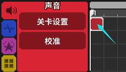
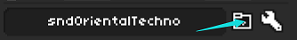
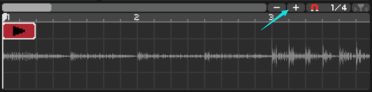
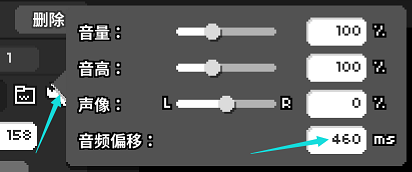
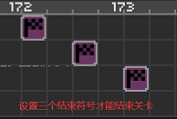
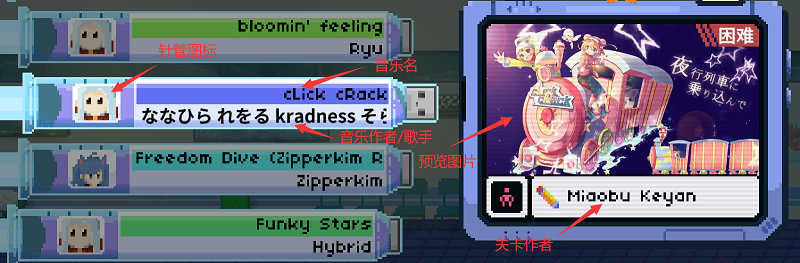

# 01 自制谱从导入到导出

## 导入音乐 

实现一首自制谱面的第一步就是导入一首音乐，音乐的格式可以是.mp3也可以是.ogg，**但我们强烈建议使用.ogg文件**，这对后续的调整偏移和选关界面试听都有帮助。如果你需要.ogg格式但是手头只有.mp3可以使用[格式工厂](http://www.pcgeshi.com/download.html)等软件转换。


注意：音乐的文件名不可以出现中文字符！


我们新建一个关卡，游戏会自动帮我们选择到节奏医生自制图的文件夹里（C:\用户\你自己的用户名\文档\Rhythm Doctor），如果想要自由设置的话也建议选择一个自己的长期稳定的文件夹，尤其是当你决定要大量制谱的时候，会方便管理。在选好的位置再次新建一个文件夹，然后打开，输入好谱面文件名，然后点确定，就成功创建了一个谱面。


在你创建关卡后，编辑器还会同时创建一个backup.rdlevel备份文件，如果做到一半编辑器崩了没保存就要打开这个文件来恢复数据。


接下来看到下方红色的界面，在这堆格子（我们姑且称之为**工作区**）的角落点一下，

可以看到左上角出现了很多功能，我们先点第一个播放音乐，

然后点击文件夹图标一样的导入按钮，这里我已经准备好了一首音乐，选择文件双击即可。**如果你导入的音乐不在创建关卡的文件夹里面，编辑器会自动复制一份音乐文件进去**。

再次提醒导入的歌曲名称**不能含有中文字符**，不然这个关卡会出问题。

## 调整曲速和偏移 

接下来一点十分重要，那就是调节bpm，也就是一分钟有多少拍的意思，由于每首歌的节拍都是不一样的，因此才需要调节，来方便我们进行编辑。排除掉一些变速曲我们可以用[MixMeister BPM Analyzer](https://mixmeister-bpm-analyzer.en.softonic.com/)，一款免费且简洁方便的测bpm软件，一般情况下精确度很高。或者你不想额外下载软件的话，也有一些在线网站可以测试，比如[编曲186](http://www.bq186.com/bpm/)和[all8](https://www.all8.com/tools/bpm.htm)。

之后还不忙慌，我们看一下下面波形图案，点击`‐`和`+`两个按钮进行缩小和放大。

一般来说，声波比较强的地方都会是音乐里卡准拍子的那一下，所以我们需要把它精确地对齐这些竖线。

如果你导入的是.ogg格式，那么导入位置的下方会有一个音频偏移的选项，改变这个数值，可以看到数字变大，波形整体左移，数字越小，波形整体右移，具体移动多少，多试几次就行。

如果你导入的是.mp3格式则需要点击图片右上角的小扳手，然后找到音频偏移。

设置好了之后这首音乐就算是和我们游戏的心电图完全对准了，只有这样才能算是一个可以玩的谱面。

## 导出关卡 

接下来点击紫色的界面，在能看到波形结束的地方点一下，然后往下翻到结束关卡按钮，或者直接按一下快捷键L键，这样的按钮一共需要放三个，我们看一下效果，其实就是依次弹出【你的评级】【S+】【精妙绝伦的演出】这三句话。注意这三句话是**必须**要在末尾显示的，否则这首歌永远不会结束。

最后我们回到红色的界面，点击关卡设置，选择上方的导出，然后填写歌曲的基本信息：

**歌手名**就是填写歌手名。

**授权**暂时可以不管，如果想要上传到Steam社区，则音乐必须取得授权，而私下交流暂时不需要。官方在主页上公布了一批已经对官方授权的音乐作者，如果你使用这些作者的歌曲就无需再单独取得授权了，详细内容参见[这个网页](https://7thbe.at/verified-artists/rd)。

**歌曲名**就是填写歌曲名，一般来说不限制语种，如果是音乐的Remix还可以写上相关版本。

**预览图片和预览歌曲**都是你能在选关界面看到的。预览图片、预览歌曲不能有中文字符。预览时间可以随便调一调。


注意：预览歌曲也最好是导入.ogg文件而不是.mp3。如果选择了.mp3，编辑器还是会花费很长的时间自动帮你转码成.ogg，很不划算。


**关卡作者**填上自己名字或是昵称。

**关卡难度**自行斟酌，一般来说固定节奏的单轨音乐选择简单即可，类似于典雅或是隐形的多轨并行可以选到困难；除非是人力很难打出S+的两指并用连打谱，或是没法玩的观赏谱，否则一般不会填写噩梦。

**癫痫警告**在特效非常花哨和晃眼的时候一定要选上，这也是对广大游戏玩家负责。

**针管图标**是选关界面最左边的小图标，**像素大小必须是19\*15**，同样文件名不能有中文字符。

下面的其他选填内容凭自己喜好填写，没有什么特别的要求了。当然了，这里因为是第一节所以没有说得那么详尽，完整的填写规则需参考[附录5](https://rd.rdlevel.cn/ex05#2)。

写完之后点击左上角的**菜单→保存**，然后点击**菜单→导出以发布→以rdzip格式导出**，我们就可以玩到这个谱了。

是不是并没有觉得特别难？不过目前它还没有背景，也缺少很多必要的视觉效果，这些都会在后面慢慢补完。我们会在后续的章节里慢慢道来。

