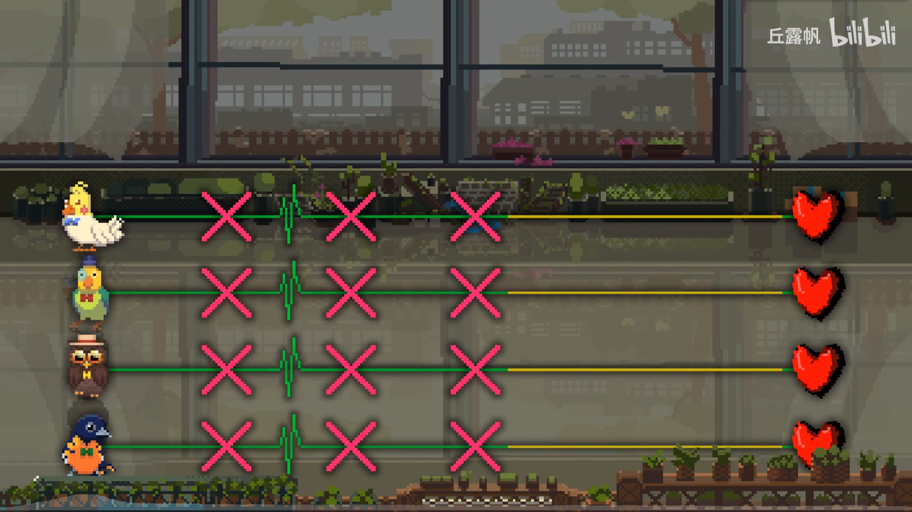
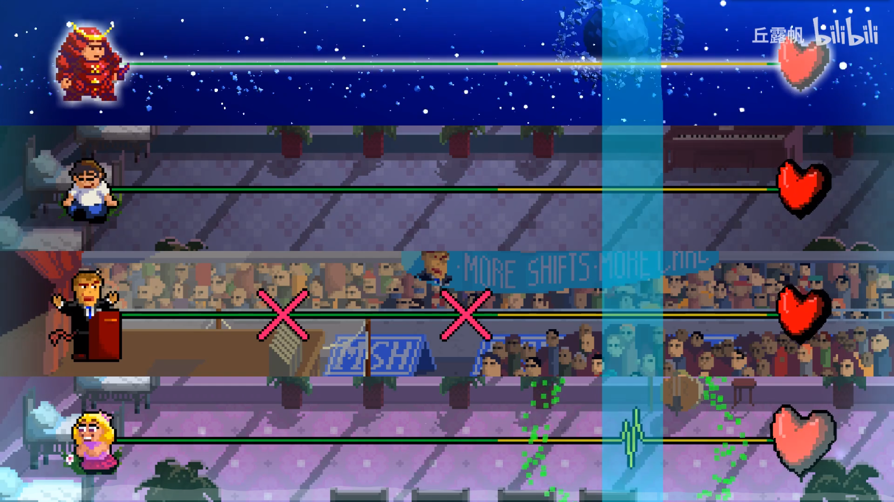
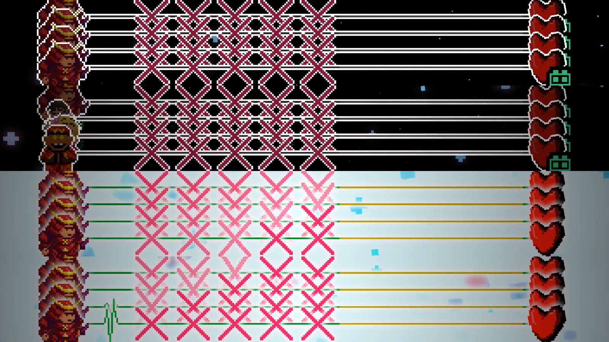
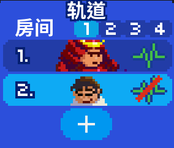

# 02 创建游戏内置的角色

欢迎回来，不多废话。在蓝色的窗口按一下`+`按钮就可以创建一个角色，每个房间最多创建四个角色，效果类似于3-3N的四只鸟，

另外，你也可以点击上方的1234来更换房间，如果在每个房间都创建一个角色，那么效果就类似于3-2N的武士/男孩/政客/女孩，他们的背景是可以互不相同的。

也就是说，编辑器最多支持`4×4=16`名角色，例如激流进行曲就是这样的。

那么在新建一个角色之后需要对角色进行设置，左上角的页面里，第一行“类型”中，“**普通**”表示像武士一样的七拍，“**单发**”表示像咖啡师一样的二拍。需要注意的是，最好在作图之前就确定七拍还是二拍，如果在做谱之后更换，那么这个角色已经编排好的节奏都会**自动消失**。

第二行“玩家”中P1,P2表示玩家1和玩家2，CPU表示电脑演示。**注意，不要在单人图中设置P2轨道**。

第三行“角色”就是设置人物的地方，点开箭头，游戏内已有的人物都在里面，也可以用`×`代表无人物。右边的按钮是导入自己设计的人物，这个功能后续会详细介绍。

第四行“节拍音效”，也就是绿色轨道上的节奏会发出什么声音。如果你不知道选什么音效合适就一个个多试试。这里也同样支持导入自己设计的声音，只需要按下图里的文件夹按钮选择音频文件即可。

第六行“重新排列”用来调整四个人物的上下顺序，不过多介绍。

第七行“房间”可以把一个角色整体移动到其他的房间去，也不多介绍。

第八行“可视化”可以把轨道隐藏，隐藏时在游戏画面里就不会看到这个角色，但是节奏会正常进行。

第九行是删除角色。

另外，在人物图像右边的这个绿色心电图是可以点击的，点击后再播放音乐，即使这个人物有节拍也不会播放，主要用于测试游戏时，人物太多的时候为了听清其中某一轨道的声音，避免混乱。

