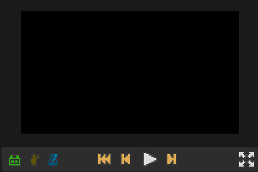
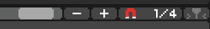

# 03 工作区里面花式操作

那么我们先来简单介绍一下进到关卡编辑器时能直观看到的这些东西。下图这个黑框，就是我们关卡制作时预览画面的地方。

下面的这些图标的功能也很直观：

左边绿色的是自动开关，打开以后就会自动按拍子；

中间黄色的小人点一下，你会发现他变成了两个，这个是切换单双人模式的开关，如果你想做双人轨道的话可以点开这个；

右边蓝色的这个是节拍器，是专门用来给你找拍子的，点开它可以方便编辑关卡。

**\|&lt;&lt;：**一般是会倒退到最左边的，如果你添加了蓝色标签（在下面有介绍），就会倒退到最近的一个标签处；

**\|&lt;：**回到上一小节，也就是倒退到上一个数字的位置；

**&gt;：**中间白色的是播放/暂停按钮，

**&gt;\|：**跳到下一节，也就是快进到下一个数字的位置；

新版本在此处还加了一个预览窗口放大倍数的按钮，可以选择1倍或者是多倍；

最右边的就是放大，可以将预览窗口拓展到全屏，很全面的看到这个关卡在正常游玩时呈现的情况。

然后我们来看下面的几个东西，左边这个长长的可以理解为进度条，可以拖拽、点击，也可以用鼠标滚轮来移动；

这里的`-`号和`+`号是用来缩放的，放大可以进行更精细的操作，缩小可以看到更多的事件；

而要进行更精细的操作，就要使用这个磁铁符号的功能了，一开始默认是`1/4`，编辑时拖动事件的移动单位是四分之一格，也就是四分之一拍，`左键点击`这个按钮可以缩小单位，`右键点击`则会放大这个单位。

最右边这个就是跟随进度条，没什么好说的。

`右键点击`轨带上面的标尺栏可以放一个蓝色标签，这时点一下之前那个倒带，则会跳到这个标签这。

说完这些最基本的功能后我们来认识一下常用的快捷键。其中的大多数都和常用的几乎所有软件相同。

| 按键 | 效果 |
| :--- | :--- |
| `A` | 打开/关闭电脑演示 |
| `M` | 打开/关闭节拍器 |
| `F` | 打开/关闭全屏显示预览画面 |
| `P` | 播放/暂停 |
| `J` | 进度条向右移动 |
| `K` | 进度条向左移动 |
| `1` | 切换到红色版块 |
| `2` | 切换到蓝色版块 |
| `3` | 切换到紫色版块 |
| `4` | 切换到黄色版块 |
| `Ctrl + W` | 切换界面大小 |
| `Ctrl + O`\(字母\) | 打开关卡 |
| `Ctrl + S` | 保存关卡 |
| `Ctrl + N` | 新建关卡 |

| 按键 | 效果 |
| :--- | :--- |
| `Ctrl + X` | 剪切 |
| `Ctrl + C` | 复制 |
| `Ctrl + V` | 粘贴 |
| `Ctrl + Shift + V` | 粘贴到下一个小节的同一拍 |
| `Ctrl + Z` | 撤销 |
| `Ctrl + 左键` | 隐藏这个事件，再点一次取消隐藏 |
| `Shift + 左键` | 逐个点击选择多个事件 |
| `Alt + 左键拖拽空白区域` | 框选多个事件 |
| `Alt + 左键拖拽事件` | 快速复制并拖拽出选定的一个事件或多个事件 |
| `Shift + Home` | 把某根轨道里所选事件之前的所有事件都一起选择 |
| `Shift + End` | 把某根轨道里所选事件之后的所有事件都一起选择 |
| `Ctrl + Shift + Home` | 把红蓝紫黄四个版块里所选事件之前的所有事件都一起选择 |
| `Ctrl + Shift +End` | 把红蓝紫黄四个版块里所选事件之后前的所有事件都一起选择 |

