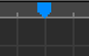

# 03 工作区里面花式操作

那么我们先来简单介绍一下进到关卡编辑器时我们看到的这些东西。这里这个黑框，就是我们关卡制作时呈现效果的地方。

下面的这些图标的功能也很简单。

左边绿色的是自动开关，打开以后就会自动按拍子；中间黄色的小人点一下，你会发现他变成了两个，这个是切换单双人模式的开关，如果你想做双人轨道的话可以点开这个；蓝色的这个是节拍器，是专门用来给你找拍子的，点开它可以方便编辑关卡。

左边这个是倒带，一般是会倒退到最左边的，在它右边的这个是回到上一节，也就是倒退到上一个数字那，中间白色按钮是播放，对应的是键盘的`P`键，右边这个是跳到下一节，下一个数字那。最右边的就是放大，可以将预览窗口拓展到全屏，很全面的看到这个关卡在正常游玩时呈现的情况。

然后我们来看下面的几个东西，左边这个长长的可以理解为进度条，可以拖拽、点击，也可以用鼠标滚轮来移动，这里的`-`号和`+`号是用来缩放的，放大可以进行更精细的操作，缩小可以看到更多的事件，而要进行更精细的操作，就不得不谈这个东西了，一开始默认是`1/4`，编辑时拖动事件的移动单位是四分之一格，也就是四分之一拍，`左键点击`这个按钮可以缩小单位，`右键点击`则会放大这个单位。最右边这个就是跟随进度条，没什么好说的。`右键点击`轨带上面的标尺栏可以放一个蓝色标签，这时点一下之前那个倒带，则会跳到这个标签这。

说完这些最基本的功能后我们来认识一下常用的快捷键。其中的大多数都和常用的几乎所有软件相同。

| 按键 | 效果 |
| :--- | :--- |
| `Ctrl + X` | 剪切 |
| `Ctrl + C` | 复制 |
| `Ctrl + V` | 粘贴 |
| `Ctrl + Shift + V` | 粘贴到下一个小节的同一拍 |
| `Ctrl + Z` | 撤销 |
| `Ctrl + 左键` | 隐藏这个物件，再点一次取消隐藏 |
| `Shift + 左键` | 逐个点击选择多个事件 |
| `Alt + 左键拖拽空白区域` | 框选多个事件 |
| `Alt + 左键拖拽物件` | 快速复制并拖拽出选定的一个事件或多个事件 |
| `Shift + Home` | 把某根轨道的所选物件的前面的所有物件都一起选择 |
| `Shift + End` | 把某根轨道的所选物件的后面的所有物件都一起选择 |
| `Ctrl + Shift + Home` | 把红蓝紫黄四个版块里所有所选物件之前的物件都一起选择 |
| `Ctrl + Shift +End` | 把红蓝紫黄四个版块里所有所选物件之后前的物件都一起选择 |

