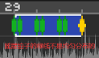
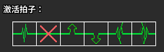
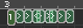
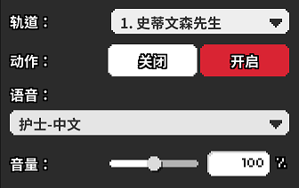

# 04 七拍子能够做些什么

## 七拍子功能介绍

让我们结束枯燥的概念，回到关卡制作中来。在接下来的三期视频里，我会统一使用《Freedom Dive》的Remix版本来讲解七拍子，二拍子以及长按拍子各自能实现什么样的功能。

首先我们从七拍子开始，新建一个人物，节奏类型使用默认的“普通”。 在工作区随便点击一下就会产生一个七拍子节奏，这个节奏一般是比较慢的，如果想改变它的速度，可以在左上角的“拍长”修改数值，也可以直接点击拖动拍子的两端来缩放。另外按住`Ctrl + 鼠标滚轮`也可以调节。

第二个选项“摇摆”就是官方图里老奶奶那样的摇摆七拍子，可以使用拖动条来调节，对照下方绿色竖线的移动可以很直观地看到摇摆效果。


不要把摇摆程度拖到滑条的最右端，这样会产生一个不带`X`记号但只有2，4，6，7拍的节奏，无法读谱。


第三个选项“按下时间”就是官方图里矿工的那个长按节奏，我们暂时不算在七拍子的节奏里，后面再介绍。 

那么我们要如何加入类似于`1-2`那关的`X`记号呢？在生成一个节奏之后，点击“切换为不可见拍子设置”就可以调节。

按下鼠标左键是加入`X`记号，按下鼠标右键一次是`↑`箭头记号，两次是`↓`箭头记号。按下鼠标中键一次是摇摆心跳记号，两次是抖动心跳记号。

最后一个选项是分解为自由时长节拍，也就是可以完全自己定义拍子的节奏。我们把一个普通的七拍子打散成自由时长，可以看到它变成了一个大的`1`和六个小的`>` 。这个大于号即意味着心跳向右移动一格。我们把它改成 `<` ，心跳还能向左移动，点击自定义，还可以任意指定到第几个节拍。这里需要注意的是，每一组自由时长节奏**必须使用那个较大的事件作为开头**，较小的事件数量不限，直到设计出第七拍为止。


如果你设计了一段无法数到第七拍的节奏，那么心电图就会一直停在轨道中间。请确保你的自定义拍子是能进行到第七拍的。


我在上图里设计了一个自定义节拍，但是感觉有些混乱。这就是我们使用自定义需要非常注意的地方，这个功能非常强大，但是对玩家的挑战也同样很大，如果不能给好非常充裕的节奏提示，那么对玩家来说势必就是一次初见杀。

## 护士节奏提示

如果想给一个人物的七拍子节奏加上“一二三四五六七”的护士报数，需要在红色的版块里面添加一个“设置数拍音效”，然后选择对应轨道的人物。

注意尽量调节到合适的音量大小，不要让护士太吵也不要让她听不清。

如果想要在后期关闭报数，需要再添加这个事件，然后点选“关闭”。


非常需要注意的是，如果你想要玄凤和猫头鹰的鸟叫声，它们也属于护士报数，而并非是独立的音效。玄凤只在1，3，5，7拍有声音，猫头鹰只在1，4，7拍有声音。

口哨声出现在`4-1N`这关，同样只在1，3，5，7拍有声音。


## 演示关卡

七拍子能实现的基本功能就是这么多，说了这么半天其实都不如实际上手做一个图，这里我们跳过做谱的过程，给大家展示一下仅包含七拍子的成品是什么样的，大家可以看看我们组合出了哪些节拍效果。可以在下面的链接里下载这个谱面。本节谱面由山不转水到渠成提供。



