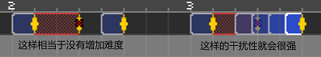

# 05 二拍子一定要加护士

## 二拍子功能介绍

我们再一次打开《Freedom Dive》，清空之前的谱面，然后加入一个角色选择“单发”，变成二拍子节奏。在空白处随便点一下，看到生成了一个二拍子，在“循环”这里输入次数，如果你想一共拍空格八次，那么就在这里输入`7`。

按一下“分解为单发节拍”，会发现他们都散开了，但是节奏本身是没有变的，只是方便你去单独操作。

按一下撤销再看看，会发现合并起来就会多一个“间隔”的设置，这个指的是两个黄色竖条之间的时间长度，把它改成`1`，会发现节奏变得紧促了很多，这样的改变间隔在没有提示的情况下是不要去轻易使用的。

拍长这个选项也可以在下面直接拖动首尾两端来改变，把它改成`2`，节奏就变慢了，二拍子的速度变化在`2-2`这一关里面被大量使用。如果要制作摇摆二拍子，其实也就是把普通的二拍子压缩到四分之三的长度，再放更密集。

按一下`◇`符号，节奏拍变成了一个方框，和最后的画画奖励关相同，在官方的设计思路里，它会在只出现一次二拍子的情况下使用。

按一下`×`符号可以设置跳过节拍，和`2-1N`这关一样。按照官方的说法，跳过一次二拍子会增加心里默数节奏的难度，所以在设置跳过二拍子后最好要设置一个时间更长的二拍子或者是叠加多个二拍子来混淆视听。

这里还有一个隐藏按键，点选一个节拍再按住`Shift + H`，就会显示出来，可以把节拍变成超大爱心，就和`2-X`的最后一拍一样。

## 冰冻拍子

另外还有一个延长选项，设置它之后就会把二拍子变成冰冻拍子，它的设计原始目的是制造一个拍子滞后的效果，滞后的时间和提示的冰冻音时间相同。但是目前的游戏版本里面还没有使用到这个玩意，所以目前来说也没有一个完全确切的用法规范。

我会在这里讲解一下冰冻拍子的解读方式，但不会涉猎太深，在新的剧情章节出来之前，大家都可以自由脑洞这个功能，不必被框架束缚。

对于一个冰冻拍子而言，一共有五个关键时间点，我都标注在图上了。

* 时间1和时间2会显示两次冰冻效果并配合冰冻音效，展示的是冰冻拍子的延迟时间，也就是填写`延迟:0.5`的地方。
* 时间3是一根绿色的线，在此时二拍子轨道上会响起一个心跳节拍。 ``
* 时间3和时间4之间就是填写`拍长:1`的地方。
* 时间4是一根蓝色的线，显示的也是一次冰冻效果。 ``
* 时间4和时间5之间的长度是和`延迟:0.5`完全相同的。
* 时间5是一根黄色的线，是要按下空格的时间。
* 时间1和时间5之间，是填写`间隔:6`所对应的时间长度，也就是完整的时长。
* 最后剩下的时间就是时间2和时间3之间，长度为`间隔6-拍长1-延迟0.5*2=4`，其结果必须大于等于0。

所以冰冻拍子的读谱方式是：

1. 记住给定好的初始的护士Get-Set-Go!的**拍长**时间间隔①；
2. 在完成一些普通二拍子后，突然响起两声冰冻声，记住这两声**延迟**的时间间隔②；
3. 等待画面和音效中二拍子心跳的出现；
4. 在相隔一个时间间隔①后会再次出现冰冻声；
5. 在相隔一个时间间隔②后按下空格。

## 护士节奏提示


二拍子一定别忘了护士节奏提示！！！！不加护士会让玩家对节奏非常困惑。


要添加护士节奏，就在红色的版块里，使用护士语音设置功能。这个界面里面的内容就比较直观了，

**护士应当说什么？：**就是护士的台词。

**语音：**里面可以选择人物，除了护士之外在博美犬那一关还出现了伊恩的声音，甚至也可以选择只有灯光没有声音。

**拍长：**这是配合着二拍子速度用的，如果二拍子的速度是一拍一下，那么这里护士的语速也是选择1拍，其余同理。摇摆拍子也是一样，把护士念词和二拍子保持相同节奏即可。

**音量：**字面意思。注意尽量调节到合适的音量大小，不要让护士太吵也不要让她听不清。

**分解为独立事件：**按下之后会把整段句子拆分成一个一个的音节，这样方便每个音节单独拖动位置，摇摆拍子必须得按音节来摆放，整体是无法实现的。

一般来说，使用普通二拍子时，对应的护士节奏应当是`Rea-Dy-Get-Set-Go!或者是Get-Set-Go!`

使用摇摆二拍子时，对应的护士节奏应当是`Rea--DyGet--SetGo!或者是DyGet--SetGo!`

使用只出现一次的二拍子时，对应的护士节奏应当是`Get-Set-One!`

对于一些自创的二拍子节奏，也要按照官方所给的上述提示型举一反三，例如将一次节奏多次按拍的二拍子设置为`Get-Set-Two!`或者是`Get-Set-Go!-Go!`等。能让玩家理解节奏即可。

## 演示关卡

最后依然是呈上一个示范谱面，还是那首《Freedom Dive》但是这次全部都是二拍子节奏。本节谱面由山不转水到渠成提供。



