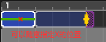
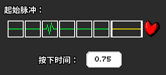
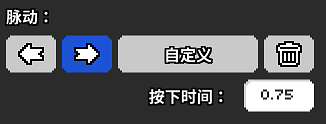
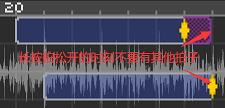

# 06 长按让节奏颇具动感

在编辑器里面，长按拍子并不是一个单独的种类，而是归属在七拍子里面的，想要创建一个长按拍子，只需要建立一个七拍子之后设置“按下时间”这个项目。这时就能在工作区看到一个紫色的格子区域，代表在这个时间段内必须按住空格键。

如果不对其添加任何其他设置，那么轨道就会自动变成 `—x—x—x————♥` 的模式，像`4-1`这关的矿工一样，也就是在1，3，5，7拍有按压的动画效果。当然你可以在“设置X标记”这个项目里面选择跳过节拍的形式，默认有三种情况，如果想使用“切换为不可见拍子设置”来自由决定跳过也是可以的，先在“设置X标记”里面选择NO，然后设置好自己决定的不可见拍子就行了。

另外长按拍子在编辑器里面也可以使用自定义节奏，但是由于剧情模式目前也没设计过这部分的实际用法，所以在编辑器里面瞎捣鼓带长按的自定义很容易搞出一些奇奇怪怪的BUG（官方：在修了在修了.jpg）。总体来说目前版本的编辑器是不太推荐用的。如果非要使用，请至少确保每一个单独拍的长按时间手动填写成完全一致的，如下图所示。

这一期的界面部分没有太多内容，接下来我们欣赏吾夜犹明制作的示例关卡，里面会包含一些需要避免的错误示范。我也会在下面列举出来。

1. 在长按拍松手的时刻不要有其他任何的单独拍子。因为长按拍子的尾判非常松，如果提前松开长按拍子，可能会无法吸收掉单独拍子而导致Miss，影响游戏体验。

2. 同时设计两个长按拍子时，不可以让它们有下面的任何一种情况：同时按下不同时松开；一个长按的时间段内包含另一个长按；两个长按的时间段互相包含。简而言之就是，两个长按拍子起始时间可以不同，但是结束时间必须相同，否则会导致其中一个拍子无法判定，必然Miss。

3. 在长按拍开始的时刻有其他任何的单独拍子，编辑器内的Auto君可能会突然降智，Miss掉一些手动能够完成的长按拍，这个时候手动测试一下玩家能否完成即可。



