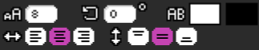
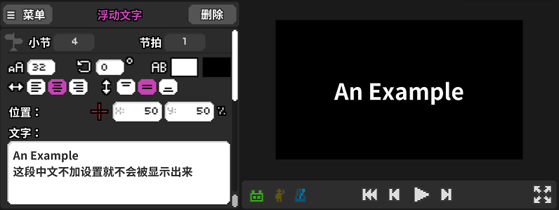
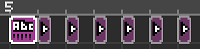
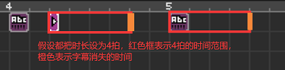

# 07 给歌曲加上同步歌词

如果我们要制作一首歌曲的谱面，那一般而言都会考虑将歌词显示在画面中，这是一种简单粗暴，但能快速提升整体可玩性的做法。要在画面中加上字幕，我们需要在紫色的板块中找到“浮动文字”功能，或者直接点击一下工作区的空白位置再按下快捷键`A`。

进入这个功能后，我们可以发现最开始的两行很有Word的感觉。`aA`可以调整字号大小，**字号基本上没有上限，如果设置太大的话，文字就会超出屏幕**。中间的按钮以旋转浮动文字框，注意是整个文本框的旋转，而不是每个字都旋转。AB中的两个颜色分别是字的颜色和字符描边的颜色，刚才所说的**字号里面，只会包含字符本体的颜色，描边是没有算在里面的**。第二行是坐标的参考位置，例如，如果两个都选择中间，那么在后续选择文字位置的时候就是按文字的正中心来确定的，如果两组按钮都选择第一个，那么就是按左上角的位置来确定的。

下一行的位置选项，按一下准星符号再在预览画面窗口中点选位置，是比较粗糙的方法。有条件精准找到位置的话还是建议在`X`和`Y`栏中输入具体数值。**点击右边的`%`按键可以切换屏幕像素点和屏幕百分比两种输入方式**。

下面的文字框就是输入文本的地方了。**纯英文文本是使用的像素字体，带有中文字符的情况下会全部变成思源黑体，如果你想要纯英文文本也显示矢量字体的话，可以回车键再在第二行输入一些中文**，如下图所示。

另外，目前已知中文繁体以及日语假名都可以在画面中正常显示（二次元歌曲狂喜）。



如果想要把一整句歌词按歌词节奏一个一个地显示出来，就需要在文本中使用“`/`”将它们隔开，然后点击下面的“创建文本递进”，在工作区里面可以拖动右箭头物件来调整时机。如果你做好了又不想要了，那么再把下面的开启改成关闭即可，无需手动删除。如果你又反悔了，还是想要，再改成开启，又会恢复记录。

如果你写了好几行文本后也点了设置递进，那么他会在原有的位置逐行显示歌词。这也就意味着，如果想要制作多行字幕显示，就只能使用多个浮动文字功能。

音节的消失方式选择淡出就是慢慢消失，立即就是瞬间消失，音节显示的时长是按创建文本递进的最后一个物件往后数拍子的。

## 更丰富的效果

这个模块的基本功能就是上面那些，但是如果想要制作视觉效果更为丰富的字幕，就需要我们打开脑洞，多去深挖这些基础功能。下面我举几个例子给大家做一些启发。



1、如果我们添加多个浮动文字模块，把纵坐标依次递减，那么显示出来的文本就是竖行排列的。

2、文本旋转效果是整个文本框的旋转，如果想要做到每个字都旋转，那么同样需要添加多个浮动文字模块，添加相同的旋转角度。如果想要让文本围绕一个中心旋转，那么直接用准星功能去找位置会方便一些。

3、如果想要给文本做一个渐变颜色的效果，或者是透明度从无到有的效果，也是在相同位置，不同时间，添加很多的浮动文字，这样新的会把旧的盖住，呈现出动态变化效果。

4、把文字递进里面添加很多错误的文字，然后全部一个字一个字回车，就可以做到文字在同一位置的乱码效果。

5、浮动文字本身是不可以移动的，如果想要让文字动起来，一般是两种方法，第一是移动整个房间，第二是移动摄像机，这样文本就相对于画面在移动了。不用担心一头雾水，这在后续的特效部分还会再提到。

6、对于无递进的一整个文本，文字是全部一瞬间显示出来的，如果想要做到PPT一样的出字效果，例如从中间向两边扩散，那同样还是需要操作房间的大小和运动来进行。

7、创建了一组文本递进之后，只需要双击最开始的那个，整组字幕都会被选中。不需要一个个手动去点选了。

