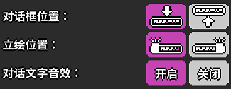
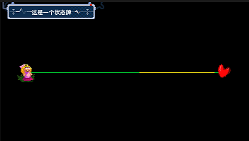

# 08 让角色在歌里聊起来

## 显示对话

在不少剧情关卡里面角色都会有聊天的过程，这在编辑器内也是可以实现的，需要的是紫色版块中的“显示对话”功能。

点开后能很清晰地看到文本框，我们就是在这里输入对话。点击右下角的微笑脸可以选择出现的人物立绘，先选择人物，再选择动作。

当然了，这个立绘也是可以在文本框里面手动写入的，尤其是当你自定义了人物角色的时候。比如添加了一个吾夜犹明的猫猫，角色的文件名取为“WYYM”，那么在每一段的开头加上“WYYM:”即可，**注意必须为英文的冒号。**对于多组表情的管理，将在后续的内容里面介绍。

下面的三个设置内容都非常直观，就不再多赘述了。


**需要注意的是：**

**1、**显示对话的功能一次只能显示一个对话框，如果前一个的字幕没有走完下一个就开始了，那么前一个会直接被顶替掉。即使设置为屏幕上方和屏幕下方各一个也会被顶替。

**2、**一个对话框只能显示两行文字，多出来的会无法显示，请注意分段。分段后需要再输入一次立绘人物，否则立绘就不再显示了。

**3、**编辑器会自动识别标点符号，并在标点符号的位置自动添加不同程度的语句停顿，非常智能。

## 显示状态牌

除了这种对话框功能之外，游戏里还附带两个显示字幕的功能：

显示状态牌会在屏幕的左上角弹出一个带字幕的状态牌，效果如下：


状态牌的文字只可以显示一行。最好给状态牌文字设计得简洁一点。


## 弹幕效果

另一种功能是弹幕效果：

这个功能会从右往左刷出一大堆相同的字符串，同样的，只支持输入一行文字。颜色也已调节，也可以选择随机的彩色。

