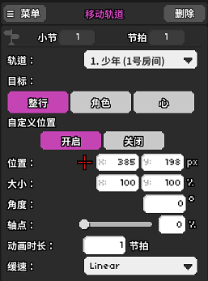
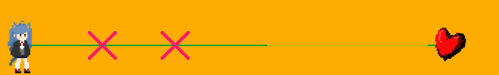
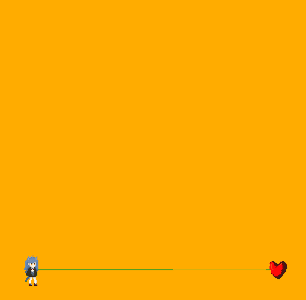

# 09 轨道移动可大有学问

## 轨道的显示与隐藏 <a id="1"></a>

在众多关卡中，高质量谱几乎都会用到轨道的显示与隐藏。这个功能可在紫色版块中找到。


打开后有三个设置项：



**轨道**：要显示/隐藏的是哪条轨道。注意一次只能选择一个，所以如果需要大批量地显示和隐藏只能一点点加入事件了。

**动作**：四个选项（显示/隐藏/仅显示角色/仅显示轨道），显示和隐藏比较好理解；仅显示角色的意思是没有中间的横线和右边的心脏；仅显示轨道的意思是没有左边的人物图。 


如果你想要不显示心脏，则需要调用自定义方法`invisibleHeart = true`，如果你还不知道什么是自定义方法，可以先参考[第27节](27.md)。


**过渡方式**：顺滑（有烟雾特效）；即刻（瞬间显示/隐藏）；全动画（仅限“动作”中选择“显示”，有完整的出场及轨道延伸动画）。

## 轨道的移动 <a id="2"></a>

轨道的移动也在紫色的版块中：


里面可以设置的项目很多，是这样的：




位置，大小，角度，轴点这四个选项都可以按下这些字所在的位置来激活和关闭。关闭则表示不产生变化。



**轨道：**选择需要操作的轨道。

**自定义位置：**选择开启时可以移动轨道的位置，并配合其他变量；选择关闭时无需输入坐标或选取位置，轨道将自动平均分配位置（即初始位置），并且移动至相应位置。

**位置：**输入框为屏幕坐标位置，`x`为横坐标，`y`为纵坐标（左下角坐标：`0%, 0%`；右上角坐标：`100%, 100%`），左侧的红十字准星选择后可直接点击视窗选择位置。点击右方的`%`按钮可以改为输入像素值（左下角坐标：`0, 0`；右上角坐标：`352, 198`）。

**大小：**轨道的大小，分为`x`（轨道宽度，即横向）和`y`（轨道高度，即纵向）两个变量，单位必须为百分比（`%`）而不能是像素，这点需要注意（初始大小为`x: 100%，y: 100%`）。注意，这两个值都是可以填写负数的，例如`x: -100%`即为水平镜像翻转，`y: -100%`即为垂直镜像翻转。

**角度：**即旋转的角度（一周`360°`），正数为顺时针转动，负数为逆时针转动。计算规则为与`0°`（初始位置）的夹角，而非与当前位置的夹角。打个比方第一次旋转了`90°`，第二次还想再旋转`90°`的话就应该填写`180°`，第二次想旋转回原始位置的话就应该填写`0°`。

**轴点：**旋转和大小设置的轴心，仅有一个变量，`0%`为角色的中心位置，轨道的最左端，`100%`为轨道的右侧，心脏的中心位置。

**动画时长：**执行动画的时长，单位为节拍。如果此处填写`0`则是瞬间完成移动。填写负数则视为`0`。

**缓速：**动画的速度变化，可自行尝试。这东西在很多需要持续一段时间的特效里都会存在，里面会有很多模式，只要把握以下原则就能快速明白了：`In`代表由慢至快，`Out`代表由快至慢，`InOut`代表由慢至快再变慢。后面不同的形式也就是快慢速的细微差距，可以根据自己的需要慢慢尝试。


如果你想直观地看看各种移动方式的速度区别，可以[看看这里](https://easings.net)。


## 移动轨道的技巧 <a id="3"></a>

这一版块我们介绍一个轨道移动的组合方式，不用把这几个例子作为教科书来看待，这只是为了引导每一个作者开拓自己的脑洞。轨道移动的方式是多种多样的。

1、**画圆弧：**x和y坐标可以单独设置，如果只想移动x轴，那么可以把y轴空着不填，这个时候再添加一个只移动y轴而把x轴空着不填的移动，它们之间就是互相独立的，允许有不同的时长和缓速方式。

```text
9小节1节拍    移动轨道{
    位置:(--,55%);
    时长:0.5节拍;
    缓速:OutSine;}
9小节1.5节拍  移动轨道{
    位置:(--,50%);
    时长:0.5节拍;
    缓速:InSine;}
9小节1节拍    移动轨道{
    位置:(15%,--);
    时长:1节拍;
    缓速:Linear;}
%% 希望你们能看得懂这种伪代码-_-!!
```



这套动作的特点在于y轴上`OutSine`和`InSine`的交替，配合线性的x轴就形成了圆弧轨迹。

如果删掉x轴移动，那么就会变成原地弹跳。

如果缩短时长，那么跳跃就会变得更加动感，可以从按下空格的时间点开始设置一套这样的移动，就变成随着按拍小跳一下。`3-1`的末尾就出现了这样的小跳。

如果延长时长，那么跳跃就会变得更加顺滑，像是`2-3N`博美犬一样随着节奏上下舞动。

2、**横向翻转：**把x坐标设置为`-100%`轨道就横向翻转过来了，这样的设置其实总的来说会给读谱增加一些难度，尤其是正反轨道同时存在的情况下。因为在玩顺了官方谱的情况下我们实际上已经形成一些惯性思维了，从左到右的心跳能够更快地识别，但是从右到左会相对来说慢一些.

3、**多轨道：**像画画奖励关那样，有时会需要一个角色多条轨道，甚至一个角色既有二拍子又有七拍子，这是怎么做到的呢？

其实原理也不复杂，一条轨道正常显示，另一条轨道在隐藏角色中选择“仅显示轨道”或是设置轨道角色时选择红色的“×”；然后把两个轨道的坐标设置得相同即可。如果想要更为动感，可加入旋转等动画以增添风味。

4、**轴点和旋转的特性：**当一个轨道在默认状态时，改变它的轴点是看不到什么变化的，但是一旦轨道发生了旋转和缩放，这时候再改变轴点，会发现轨道本身也会移动。

这就是和其他设置都有些不同的点：后续轴的改变能影响到先前的旋转和缩放的参考位置。这个时候就需要额外添加一个轨道移动来做补偿，以消除移动轴点之后轨道产生的移动。例如下面这个四方移动：

```text
1小节8拍    移动轨道{
    位置:(100px,30px);
    大小:(50%,50%);
    时长:0节拍;}
2小节1拍    移动轨道{
    角度:90°;
    时长:1节拍;
    缓速:Linear;}
2小节2拍    移动轨道{
    角度:180°;
    时长:1节拍;
    缓速:Linear;}
2小节2拍    移动轨道{
    位置:(100px,170px);
    轴点:100%
    时长:0节拍;}
2小节3拍    移动轨道{
    角度:270°;
    时长:1节拍;
    缓速:Linear;}
2小节3拍    移动轨道{
    位置:(241px,170px);
    轴点:0%
    时长:0节拍;}    
2小节4拍    移动轨道{
    角度:360°;
    时长:1节拍;
    缓速:Linear;}                            
2小节4拍    移动轨道{
    位置:(241px,30px);
    轴点:100%
    时长:0节拍;}        
```



5、**移动轨道到其他房间：**当移动轨道的距离超过`852.2727%`或者是`3000px`之后，轨道就会被强制移动到相邻的房间去。这种方法可以让轨道超出每个房间最多四条的限制，但是有小概率发生一些问题，非必要情况下最好不要做这种骚操作。

## 演示关卡 <a id="4"></a>

版面已经占的有些多了，更多的轨道移动脑洞我们留在演示关卡中间。本节谱面由吾夜犹明制作。



