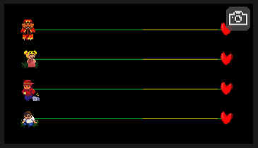
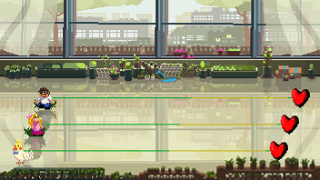

# 10 配合场景初始化轨道

当我们在一个房间里面设置了多根轨道的时候，角色位置会自动生成在屏幕上。在默认情况下，一根轨道的位置在屏幕的`(10%, 50%)`处，两根轨道的位置分别在屏幕的`(10%, 60%)`和`(10%, 40%)`处，三根轨道的位置分别在屏幕的`(10%, 70%)`，`(10%, 50%)`和`(10%, 30%)`处，四根轨道的位置分别在屏幕的`(10%, 80%)`，`(10%, 60%)`，`(10%, 40%)`和`(10%, 20%)`处。此处的坐标原点为屏幕左下角，轨道的参考位置是人物像素画的中心点。如果任其按默认位置排布，会显得有些缺乏设计感。



所以在设计全程静止不动的轨道位置的时候，我们应该在一开始就让他们站在合适的位置上，并且最好能契合背景画面。下面我们那官方自带的一些场景来举例子。使用这些预设主题需要在紫色界面里面添加“设置主题”。


在时间轴最开始的位置设好

```text
小男孩：
    位置: (49, 91)px；
    时长: 0 节拍。
小女孩：
    位置: (37, 62)px；
    时长: 0 节拍.
玄凤：
    位置: (25, 33)px；
    时长: 0 节拍。
```

这样三个角色都站在地上并且有一定的交错。没错，这就是`3-1`沉睡花园。



我们预览播放一下会发现还是存在一些问题。角色是在默认位置生成后再闪现到设置好的位置的。要优化这个问题，我们先要回到蓝色版块的人物设置里，把每个人物都选择“隐藏”，然后再时间轴的最开始加入三个“隐藏轨道”物件，让他们“即刻”出现。这样才能是一开始就在理想位置的。

