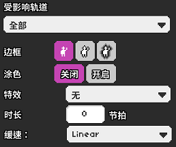
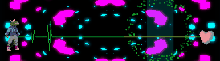
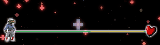
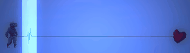

# 11 轨道相关的内置特效

## 轨道涂色

之前我们都在介绍和轨道移动有关的操作，这一节我们就换个方向，讲一讲轨道相关的视觉特效。

首先我们能直观想到的就是给轨道涂上颜色。在早期的版本中，需要在紫色版块的预设特效里面找到类似于“轨道XX”的各种特效，选择它们之后就会产生对应的效果。但是目前版本的灵活程度大大提升了，增设了一个专门的“轨道涂色”事件，所有预设特效能做到的在这里都可以手动设置出来，并且自由度比以前高很多。

但值得注意的是，预设特效里面并没有删除原有的那些轨道变色特效效果，而且变得更麻烦了，你需要先添加一个“轨道涂色”事件，无需对其做任何设置，然后再添加预设特效才能生效。如此一来反倒不如在“轨道涂色”设置内一次性搞定。

在“轨道涂色”事件中有如下的一些设置项：

**受影响轨道：**选择的轨道目标，即要为哪个轨道涂色。与移动轨道不同的是，轨道涂色可以选择全部轨道。

**边框：**边缘的三种样式。自左向右分别为：无边框，轨道边缘线，轨道阴影（除无边框外均可设置颜色）。

**涂色：**轨道内部全部涂成一个颜色，选择“开启”后可选择要涂色的颜色。

**特效：**目前仅加入了一种特效——电击，选择后轨道将出现点击的花纹，并在执行该特效的瞬间发出“刺——”的声音。注意：电击特效仅对7拍子轨道生效，对单发轨道无效。

**时长与缓速：**和其他特效中的完全一致，不过多赘述。


如果你想直观地看看各种移动方式的速度区别，可以[看看这里](https://easings.net)。


## 预设特效中与轨道相关的特效

**心跳剪影：**在出现心跳拍子的同时，为轨道涂色，且每次心跳拍子都会更换颜色。但需要注意的是，心跳剪影会取消原有的轨道涂色效果。但是又必须提前添加一个轨道涂色事件，之后心跳剪影才会生效。

**彩色冲击波：**在心爆时更改场景的色相，每次心爆都会更改一次（例如`1-1N`）


心爆：击打拍子后心脏变白膨胀并发出“咚”的声音，伴随一圈画面微小失真。默认在七拍子节奏的第八拍出现，或是在二拍子节奏的之后一拍出现。可在红色版块中自由调整心爆时机。


**按键重低音：**在击打拍子时创造色像差特效。提示：在击打拍子时放慢关卡速度可创造出更精彩的特效。

**心跳震屏：**在心跳拍子出现时产生微小的屏幕震动。注意：有些主题的背景也会跟着震动，但是有些不会。

**按键震屏：**在击打拍子的同时产生中等程度的屏幕震动。

**波状轨道：**很常用的特效，设置后使轨道上下波状漂浮。注意：波状轨道和之前提到的移动轨道并不冲突干涉。

**轨道阴影：**在轨道边缘产生微小的阴影，不是很明显，但能让画面更加真实。

**脉冲计数：**在心跳节拍出现时，伴随脉冲数字的跳动。注意：一个房间内同时只能计一个数，如果有多个轨道的节奏同时存在，这个功能可能会显示得非常混乱。

**垂直亮纹：**在心跳节拍出现时，伴随竖直的带状亮纹。注意：一个房间内同时只能高亮一个轨道，如果在高亮中其他的轨道也出现了节奏那依然是暗的。

## 一些和轨道紧密相关的特效

**闪烁：**屏幕白色闪烁，分为短，中，长三种。

**自定义闪烁：**可以自由设置闪烁时的颜色，透明度变化，持续时间和缓速模式等。其中有一个闪烁版选项，指的是把闪烁放在房间内的哪一图层上，左边为放在前景图之上，右边为放在背景图之上。层级先后的相关概念需要参见16节。

**屏幕震动：**创造一个屏幕震动（无色像差），分为轻微、中等、剧烈三种。

**重低音震动：**播放颜色变化特效，即大幅度色像差加大幅度屏幕缩放。

## 演示关卡

当然了，上面这些都是逐一地介绍和演示各种特效，如果把它们融合在一起效果会非常华（目）丽（害），本节依然是由吾夜犹明带来演示关卡。



