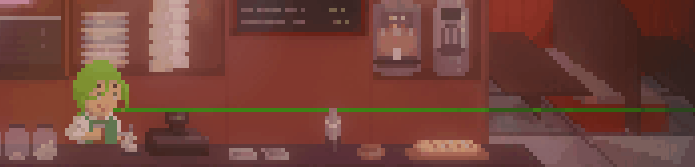
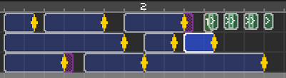
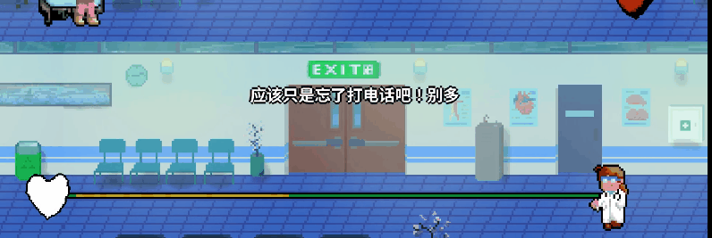

# 12 多轨并行绝对不能乱


前面花了五小节的时间讲解了一些简单且好用的让游戏看上去更能玩的效果。但是实际上，一首谱面能不能让人好好玩下去，最为根本的还是要把节奏的编排做好。这一点没有做好的话，一切画面特效都是空中楼阁。

这里我就先直接展示结论吧，下面的这些要求都是在制作谱面时能够大幅度增加可玩性和友善化读谱难度的做法。每一位看到这里的小伙伴，请一定要尽可能让自己的谱面做到这几点。

1. 如果涉及一些全新的节奏型，特别是多轨道组合或者是自由节拍，一定要做好**充足的提示**。如何确认自己的提示足够了？最好是找一些水平适中的群友或者朋友**玩一次初见**（注意最好是第一次玩，次数多了可能会背谱过），看他们的反馈，有没有不明所以的节拍，做出调整和增加提示。这一点还会在第15节具体介绍。

2. 每一条轨道的**节奏功能做出严格的区分**，如果场上本身就有多轨，不要给一条轨道设计过多差距太大的节奏类型。同时，非必要尽量不要增添太多轨道。让很多轨道展现出花里胡哨的节奏但却在同一拍按键也会让人感觉很牵强。

3. 多轨道情况下如果有某条轨道**长期没有节拍请一定将它隐藏**起来。玩家看到过多的闲置轨道是并不能意识到它们会在什么时候出现拍子的，只会提心吊胆地玩下去。

4. 轨道数量的并行最好是**循序渐进**，刚入场就咣咣咣咣四个轨道容易把玩家吓着。特别是有新节奏的情况下，最好能拿一段时间来单独为新节奏进行教学，然后再与其他轨道组合。 

5. 节奏医生的游戏机制是和一般的音乐游戏不同的。音乐游戏是可以给每一个节奏点都设计按键（Node）的，但节奏医生却不能这样。节奏医生的本质是“提示拍 + 按键拍”的组合，**所有的提示拍全都应该按照没有按键的节奏点来设计**。如果像其他音乐游戏一样来设计节奏医生的谱面，得到的一定是塞爆谱。

## 

按照上述思路我们回忆一下《典雅》这关。轨道是从最慢的武士开始，然后加入稍快的小男孩。节奏熟练之后曲子过半，武士和小男孩隐去，政客登场，他是本关的新节奏。单独的几次政客拍子练习后再加入武士，高潮部分加入小男孩。这关的按键频率也不会很高，但是节拍的有效利用率非常充分。《典雅-夜》加入了小女孩之后又把难度提高了一个层级。现在你是否领会到本小节阐述的奥义了呢？

