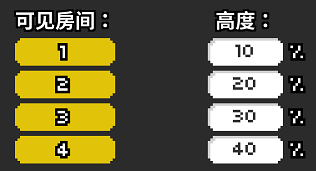
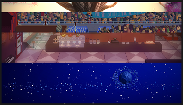
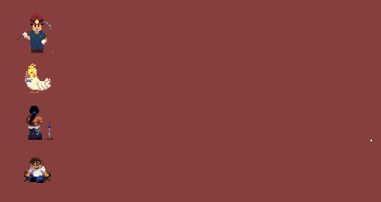
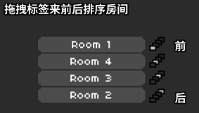

# 16 房间究竟该如何理解

从这一节开始，我们的节奏医生编辑器教程就提升到一个进阶的水平了，前面的15个章节讲解了编辑器的各种基础功能，足够用来完成一个中规中矩的谱面。为了让游戏的体验更加丰富，就需要学习更多更花哨的内容，这一节我们就从理解“房间”的概念开始。

编辑器总共支持四个房间，你可以想象成一栋宿舍有四个房，每个房里面可以住四个人，同时，每个房间的装修可以随意摆设互不干扰。房间的排布方式有两种，第一种是按照从上到下的顺序一行一行显示，我们在黄色的版块里添加一个“排列显示房间”就可以这样设置。

## **排列显示房间**

将左边的可见房间点亮为黄色，屏幕上就会显示这个房间，高度可以自定义，如果不填的话就是默认平均分配。如果填写的数据总和超过了`100%`，那么就会按比例缩小到总和为`100%`，不填写的部分视为`0%`。例如，如果像上图四个房间填写`100%`，`200%`，`300%`，`400%`，那么实际效果和`10%`，`20%`，`30%`，`40%`是完全一样的。

下面还留有一个时长和缓速的选项，这个和轨道移动的时所介绍的设置规律是完全相同的。如果填写0拍就是瞬间完成房间分配；各种缓速模式参见这里。

## **房间的前后关系**

但实际上很多时候我们并不想就让房间这样死板地上下排布，甚至想让这些房间交叠在一起。打个比方，我在1号房间设置了男孩病房的主题，但是在2号房间设置的小男孩轨道，同时，我想让轨道显示在1号的主题中。要做到这一点，我们得先明确各个房间叠在一起的时候，它们的前后关系是怎样的。

首先看一个房间内，各种事件的由前往后关系是：

> 【显示状态牌】&gt;【浮动文字】&gt;【弹幕效果】&gt;【前景图片】&gt;【轨道4】&gt;【轨道3】&gt;【轨道2】&gt;【轨道1】&gt;【背景图片】

它们的前后顺序是不可改变的。

各个房间整体之间又有前后顺序，默认由前往后关系是：

> 【房间1】&gt;【房间2】&gt;【房间3】&gt;【房间4】

这个顺序是可以改变的，只需要在黄色版块内添加一个“重新排序房间”物块，然后把前后顺序拖动到想要的即可。

## 背景图片

## 前景图片

介绍完这些铺垫知识，本节内容量也相当大了，下一节我们就开始介绍房间排布里自由度最高的部分：移动房间。

