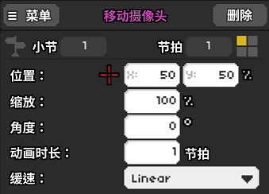
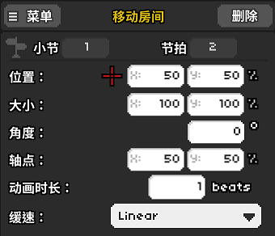
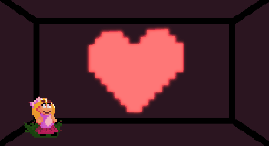
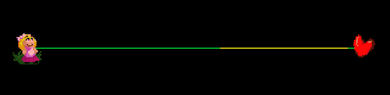

# 17 房间和镜头移动之１

## 概述

移动摄像头和移动房间应该是整个编辑器内灵活性最高的功能之一了。它的灵活性本身并不是基于对编辑器功能的理解的，而是更类似于对摄影或是视频制作手法的理解。我们观看电影也总是会说“镜头语言”，这话同样在制作关卡时适用。合理的镜头运用可以极大程度提升关卡的视觉观感。


当然了，我们做关卡也并非是拍电影或者是画动画，并且大多数时候都是一个人作图，肝的数量也比较有限。在**有限的时间成本之内**最大化地设计好镜头才是最重要的。

就其功能本身而言，实际上内容和移动轨道并无太多差别，只是作用的对象分别是摄像头和房间而已。移动摄像头在紫色的板块中，移动房间在黄色的版块中。

如果你还不理解“位置”，“大小”，“角度”，“轴点”，“动画时长”，“缓速”的具体意思，请参考第9节轨道移动。


但还是有一点需要强调，在没有做任何房间类设置的情况下，房间1的默认大小是`(100%, 100%)`，而其他的房间都是`(0%, 0%)`。


## 以移动摄像头为主的技巧举例

1、所谓的移动摄像头，画一个三维空间出来也许可以让你更好地理解。它就像是我们举着一台摄像机拍摄自己的家一样，你的手或者身子移动，那么摄像头跟着移动，拍摄下来的整体画面位置就会不同。

2、移动摄像头最基本的用法就是把摄像头跟着节奏晃来晃去，与全程静止不动的背景相比，这样会给谱面增加一些动感。这个轨道移动的弹跳设计原理是一样的，仅仅是呈现的画面效果稍显不同。

3、让摄像头移动到画面中你想要突出强调的地方，例如某个轨道，或者是某个你想要展示的物件/画面。

