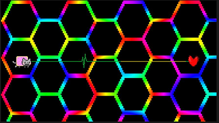

# 18 房间和镜头移动之２

## 以移动房间为主的技巧举例 

**1、**和移动摄像头不同，移动房间你可以理解成一个情景剧的拍摄现场，观众和摄像头都是固定不动的，但是要更换场景时，需要道具组挪开先前的场景，放置新的场景。当然了，这种视觉上如同PPT换页动画一般的移动房间形式也只是最基本的。

上图的例子的实现方法实际上是在屏幕之外`(154%, 50%)`的位置放置房间2，然后将房间1和房间2同时向左移动。


也许你们会觉得，运动是相对的，把房间左移其实和把摄像头右移完全等效，这样的想法是正确的，但要注意在移动摄像头时选择移动“**顶部**”而非某个房间的摄像头。


**2、**实际上很多时候我们期待的是多个房间叠在一起，然后各自拥有各自独立的部分。这样会方便把一些互不相关的图片元素分别按各自的方式运动。如下面的例子，公路，山坡，白云，蓝天的运动速度都不一样，毕竟在画面中的远近关系不一样，但是就必须分成四个房间，然后设置四个移动房间事件，把位置都改为`(50%, 50%)`，把大小都改为`(100%, 100%)`。然后设置不同的背景，使用平铺的方式，设置不同的水平移动速度_（这是16节的内容，还记得吧？）_。

但是将四个房间全部时你也许会发现只能看到其中一个房间的内容，这个时候我们回想一下16节房间前后关系的内容，然后需要告诉你一个非常无奈的事实：房间的纯色背景和图片背景其实是相互独立的，即使你导入的图片本身已经画出了透明背景，但仍然需要加一个设置背景的事件，再把纯色背景调成透明。

**3、**房间也是可以放大和缩小的，而且有两种不同的缩放模式。第一种是普通的缩放，需要在黄色版块放置一个“设置房间内容模式”然后将其选择为“拉伸”。另一种类似于剪裁图片，需要在“设置房间内容模式”中选择“保持长宽比”。

在拉伸的模式下，如果把画面的一部分镂空（在图片编辑软件里面显示为透明），然后在里面放置其他的画面，让他们一起运动，会产生奇妙的效果。还记得`2-1N`中科尔房间的电脑与武士房间之间放大缩小的转场方式吗？就是靠这个来实现的。

在保持长宽比的模式下，可以做出`4-1N`这样的转场效果。

**4、**如果完整图片已经做好了，不像再把图片本身挖空一部分了怎么办呢，就需要用到房间遮罩功能。

它的本质其实有点像图片编辑类软件中的图层蒙版。看下图就很好理解。

房间1是东方不眠日，房间2是东方失眠夜。在房间1中添加一个某老鼠的头像图片，图片中的其他部分均为透明，那么最终的效果就是头像的范围内可以透过房间1的遮罩看到房间2。

反过来也是一样的，在房间顺序不变的情况下，只要把房间遮罩图片的头像部分设置为透明，其他部分涂黑，就能看到夜晚的主体场景和白天的遮罩场景。

另外，对于一些瞎眼的特效，添加一个好看的遮罩会有奇效。

**5、**最后还有一个淡入淡出房间功能，这一点倒是没有太多可说的，调节的是房间整体的透明度。同样也可以选择时长和缓速模式。

最基本的用法就是把一个房间的透明度从`0`调到`100`，另一个从`100`调到`0`，完成淡入淡出的转场。

## 示例关卡 

第17节和第18节因为说的是一个整体性的东西，所以关卡也合并在一起。本节示例关卡由吾夜犹明提供。



