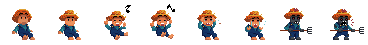
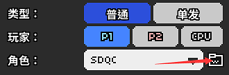
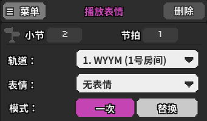

# 20 制作一个自己的人物

## 像素画 <a id="1"></a>

完全自制一个角色的前提当然是要学会画像素画，因为游戏关卡内的画面都是像素风格的。能画像素画的软件市面上非常多，包括但不限于商业软件[Photoshop](https://www.adobe.com/cn/creativecloud/buying-plans.html)，[SAI](https://www.systemax.jp/ja/sai/)，Steam平台上的[Aseprite](https://store.steampowered.com/app/431730/Aseprite)等。当然免费的软件也是存在的，例如在线像素画软件[Pixcel](https://www.piskelapp.com/)，在一票免费软件中，这款的好用程度谁用谁知道。

具体的软件教学和像素画绘画技巧我就不在这里献丑了，去B站能找到相当多的教学视频。我要讲的只是最后一步，导出精灵图（Sprite）。

当然首先得知道精灵图是什么。我们查看游戏的内置人物，会发现它们都不是静止的图片，而是会随着节奏摇摆的（例如武士的点头），也是能做出各种动作的（例如咖啡师左右互搏做咖啡），这些动作在编辑器中并非是以.gif动图的形式来存放的，而是把每一帧都拆出来，并排放在一起保存成.png。这就叫做精灵图。



要注意，每一帧所留出的画布大小都必须是相同的，画多大的人物在绘画之前就应当考虑清楚。在像素画软件里，通常都有直接导出精灵图的功能。

## .JSON文件

图片现在是有了，但是想要编辑器识别这个图片，还没有那么简单，我们需要自己写一个.json文件。模板在下面：

```text
{
"size": [48, 48],
"name": "渠成",
"clips": [
    { "name": "neutral", "frames": [0,1,2,3,4,5], "loop": "onBeat", "fps": 0, "portraitOffset": [10, 20], "portraitSize": [24, 45], "portraitScale": 2},
    { "name": "happy", "frames": [0], "loop": "no", "fps": 0 },
    { "name": "barely", "frames": [0], "loop": "no", "fps": 0},
    { "name": "missed", "frames": [0], "loop": "no", "fps": 0, "loopStart": 0 }
]
}
```

如果需要使用，只需要把这一堆复制下来保存到.txt中，数据按自己的来改动，最后把文件后缀名改成.json即可。**注意这个文件的文件名必须和精灵图的完全一致**。

至于这段代码里到底要改些什么，我们一个个看。

**`"size"`：**这里填写的数字是精灵图里每一帧图片的像素大小，必须要和自己设计的大小完全一致，编辑器才能把图片正常切分。

**`"name"`：**第一次出现的name里填写的名字会显示在对话中。

**`"name"`：**后续出现的name指的是人物的各个状态，`neutral`表示普通状态，`happy`表示拍子按对时的状态，`barely`表示拍子按歪时的状态，`missed`表示漏过没按时的状态。这四个状态是默认存在的，因为和按拍效果有关，但你也可以再次基础上新开一行，自己命名一个其他状态，这会在显示对话的立绘中有效。

**`"frames"`：**这是每种状态所涉及的帧数。在精灵图里从左往右，从0开始计算。例如：写`[0,1]`那就是取第1张和第2张组合成两帧的动图，写`[3,5]`那就是取第4张和第6张组合成两帧的动图，写`[0,1,1,1]`那就是取第1张和第2张组合成四帧的动图，其中第2张播放三次。

**`"loop"`：**动图的循环模式，如果是`no`那么播放完就会自动回到neutral状态，如果是`onbeat`就会一致循环。

**`"loopStart"`：**如果设置为循环，这个参数可以更改从第几帧开始播放。

**`"fps"`：**动图播放的帧数，填大于0的帧数，就是按填写的帧数播放；填0就自动随着音乐bpm改变。

**`"portaitOffset"`：**截取动图中的一部分作为显示对话时的立绘，两个数字表示截取立绘的起始位置。以每一帧画面的左下角作为原点，第一个数字为横坐标，第二个数字为纵坐标。

**`"portaitSize"`：**截取动图中的一部分作为显示对话时的立绘，两个数字表示截取立绘图片的像素大小。第一个数字为立绘的宽度，第二个数字为立绘的高度。

**`"portaitScale"`：**图片放大比例，这是显示对话时的立绘用的，因为立绘画面一般都只是人物的头部和上身，且立绘窗口也比较大，这里最好填写大于1的数字。

## 回到编辑器添加人物

一切准备就绪，现在进入编辑器添加一个人物，然后在人物设置里面点一下文件夹图标，选择刚才我们写好的json文件。



编辑器会提示你没有找到人物阴影相关的文件，是否自动创建，选择是就可以了。这样人物就被我们成功导入进来了。

## 播放表情

我们在前面提到了，人物在节奏按对按错时都会自动变化表情。在没有节奏的时候手动变化表情也是允许的。在紫色的版块里面可以找到“播放表情”功能。



轨道就是选择需要变化表情的轨道，表情里面这四个和上面说的都是一一对应的。模式里的“一次”指的是播放新表情一遍之后自动回到原来的，“替换”指的是表情完全切换到新选择的上。

## 选择立绘

在第8节我们已经提到过，显示对话的对话框中手动写下立绘名字也是可以插入立绘的。如果我们在这里导入一个文件名为“WYYM”的猫猫，然后在对话框的开头写下`WYYM:`，那么播放的立绘就是默认的nautral那一行。如果我们自己添加了一行新的状态，例如：

```text
{ "name": "Error", "frames": [0,1,2,3,4,5], "loop": "onBeat", "fps": 0, "portraitOffset": [10, 20], "portraitSize": [24, 45], "portraitScale": 2},
```

那么如果想要插入这一行所对应的立绘，就要在对话框里面写`WYYM_Error:`，也就是下划线加上对应状态的名字。

## 奇技淫巧

最后想要提到的一点是，不要把思想限制住了，觉得添加人物那么添加的一定只能是“人物”。实际上如果在作图是有对一些小物件例如花草树木，云彩鸟儿，爱心，圆圈方块有移动/变化等的需求，那么将其作为一个人物导入进来是最方便的。使用“隐藏轨道”功能把它们改成只显示人物，然后使用“移动轨道”来操作。

这么做的话场景元素的数量也支持很多，每个角色有四个默认状态，你完全可以画不同的东西，例如无表情画成圆圈，开心画成方块，失误画成三角。在它们需要上场的时候添加一个替换表情就行了。

