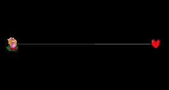

# 21 镜　　　　　　　厅


预警放在最前面：观看本节教程图片可能会引发癫痫，在编辑器中使用此功能也请慎重处理。


所谓的镜厅效果，就是画面在变化的时候并不清除变化过程中产生的效果，画面效果会一直叠加，然后逐渐变得混乱。

镜厅一共能在两个地方找到，一是设置主题中的“镜厅”，二是预设特效中的“镜厅”。**但最好使用预设特效中的**。

### 镜厅 + 悬浮物 

添加诸如矩阵，落雪，落花等不断漂浮移动的特效，它们都会拖出长长的一条轨迹出来，直到屏幕被占满。

### 镜厅 + 落雨 

落雨效果的雨滴是高密度向左下滴落的，如果加上镜厅，雨点会很快将屏幕涂满白色，此时再有其他的物件在屏幕上，也会拖挂一个朝向左下角的尾巴。但是其他物件不会再屏幕上拖尾太长，因为它们马上又会被带镜厅的雨滴给覆盖掉。

### 镜厅 + 彩色冲击波 

冲击波会在镜厅的影响下变成彩色条带，而且还会随着按拍的次数叠加。

### 镜厅 + JPEG失真 

画面割裂开并持续向左滚动。

### 镜厅 + 海底波浪 

这种屏幕扭动类的会逐渐变得更加扭曲。

### 镜厅 + 滚屏 

直接崩坏。

### 镜厅 + 屏幕块 

这个需要配合晕影使用，不然也会直接崩坏。

要注意屏幕块是可以填写小数的，例如填写`x = 1.05, y = 1`，自定义闪烁透明度`15%~0%`。

### 镜厅 + 高光 

火光冲天。

但是如果叠加上屏幕滚动和晕影就会出现奇效。

### 镜厅 + 晕影 

晕影效果可以大幅度地减弱镜厅的拖尾，让画面拖动变得柔和很多。

### 镜厅 + 闪烁 

添加屏幕闪烁可以把屏幕上所有的滞留画面都暂时清除干净，但如果不关掉镜厅本身，接下来很快屏幕还是会被镜厅填满。但要注意，在自定义闪烁中设置的结束时的颜色，会余留在屏幕背景上。

### 镜厅 + 设置背景 

虽然背景的优先级很靠后，但是实际上背景图片会盖住镜厅效果，只有背景图中透明的部分才能看到镜厅所造成的拖尾。

另外，给背景设置一定的透明度也可以有效降低镜厅产生的目害。

### 镜厅 + 移动房间 

虽然背景本身不会受镜厅的影响，但是如果把整个房间缩放和移动，那么房间整体就会在最后方的黑屏上开始堆叠起来。

### 镜厅 + 颜色反转 


罗老师，别这样。


这么做的后果是屏幕会高频率反色闪烁，非常伤眼。

