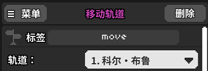
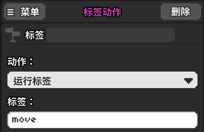

# 24 如何整理一大堆事件

## 设置标签事件

有时候我们需要大量重复地完成一些特效，例如轨道和房间的循环移动等，每次都是好几个移动事件作为一组。如果每次都是大段大段地复制粘贴，那么操作栏里面的空间很快就会被占满了。

设置标签事件为我们很好地解决了这个麻烦，只要把一组事件都添加一个标签，那么接下来想要运行这一整组事件，只需要在添加一个“标签动作”即可。

要设置标签，首先需要选中一个事件按下`Shift + 0`，这时就能看到事件的上方多了一个名为标签的栏目。在里面填好自己设置的标签名，例如move。这个时候应该能看到轨道移动的图标左下角多了一个黄色的小三角（如上图所示）。

有了标签之后，再去紫色的版块添加“标签动作”事件。在标签栏同样填写move。

这时播放一下音乐你就会发现，轨道移动本身已经不生效了，只有时间轴走到“标签动作”的对应时刻才会让标签动作生效。

