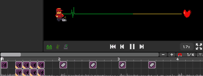

# 24 如何整理一大堆事件

## 设置标签事件 

有时候我们需要大量重复地完成一些特效，例如轨道和房间的循环移动等，每次都是好几个移动事件作为一组。如果每次都是大段大段地复制粘贴，那么操作栏里面的空间很快就会被占满了。

设置标签事件为我们很好地解决了这个麻烦，只要把一组事件都添加一个标签，那么接下来想要运行这一整组事件，只需要在添加一个“标签动作”即可。

要设置标签，首先需要选中一个事件按下`Shift + 0`，这时就能看到事件的上方多了一个名为标签的栏目。在里面填好自己设置的标签名，例如move。这个时候应该能看到轨道移动的图标左下角多了一个黄色的小三角（如上图所示）。

有了标签之后，再去紫色的版块添加“标签动作”事件。在标签栏同样填写move。

这时播放一下音乐你就会发现，轨道移动本身已经不生效了，只有时间轴走到“标签动作”的对应时刻才会让标签动作生效。

如果有多个事件都设置了同一个标签名，那么标签动作也就会按照这些事件的相对事件顺序依次生效。

此功能需要注意的是，应确保所有带有相同标签的事件位于同一小节内，否则事件不一定按照时间轴上的相对顺序执行。要解决此问题也有一个好办法，在关卡结束之后的空白部分添加一个“设置音节长度”，然后填写为99，把所有的带标签事件都扔在后面就可以了。

## 让事件摆放更有条理

考虑到还是会有一些情况下事件并非都是重复的，而是零零散散真的有一大堆。这种情况下把事件摆放清楚会在作图的过程中事倍功半。

**1、**整个工作区一共只有四行，所以每一行放些什么东西最好能由明确的区分，比如把贯穿全程的浮动文字歌词都放在同一行，把移动轨道都放在同一行等。

**2、**对于事件总体数量不太高的情况，如果有一串同类型的事件紧密排布，例如每1/4格或者1/2格放一个，那么可以考虑不放在同一行，而是上下交错排开。

**3、**对于事件总体数量不太高的情况，如果有操作房间和轨道类型的特效，可以考虑把他们放在对应数量的行里，找起来会更加方便。

**4、**如果你发现在音乐初始位置需要叠放大量特效来给各个轨道和主题等做初始化，那么也最好把同类特效叠在一起。这分为两种情况：一种是相同的特效叠在一起；另一种是操作相同的对象的叠在一起。这两种都是非常直观的。

**5、**如果需要花费一个比较长的时间跨度来制作一个谱面，那么最好放置一些注释来解释每一个小段的设计思路，以免在咕咕了一阵子之后完全失去了方向。注释事件在紫色的版块里。

