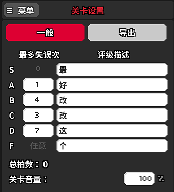
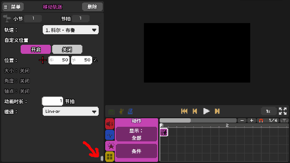

# 26 零零碎碎的事件拾遗

最后还有一些不太好归类但是总该提一句的内容，就放在这个地方吧。

### 显示手/手涂色 

在紫色版块里。显示手就是把屏幕上那个手和按钮显示出来，涂色和轨道涂色的原理是完全一致的。

### 设置音节长度

在红色版块里。其实就是修改一个小节有多少拍。其中还有一个节拍视效倍率选项，一般来说没有修改的必要。这个指的是导入的轨道人物和其他随BPM一起律动的玩意会按照如何的事件比例播放动画，1就是和BPM一致，数字越大动得越快，越小越慢。

### 注释

在紫色版块里。嘛，写注释也是个好习惯。不过至于真用不用，还是看个人爱好。

### 关卡设置→一般

这里填写的是成绩S到F分别miss的拍子数量，以及显示的评价文字。这东西最好不要保持默认值，而是根据做谱的情况来合理修改，难度不大，那就数字写小，难度很大，那留出来的容错空间也应该更大。

有的同学可能会想：反正最后都是要刷到S+的，至于其他等级如何评定，完全无所谓。这种想法稍欠妥当，玩家打出第一次的成绩也是会影响其是否能有平稳的心态和兴趣收歌的。

### 设置栏显示模式 

对于一些带有右侧拖动条的事件，点击拖动条下方的小按钮可以改变编辑器的整体布局。

