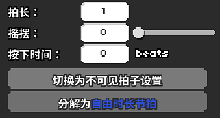
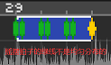
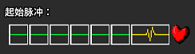
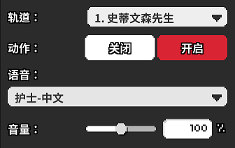

# 04 七拍子能够做些什么

## 七拍子功能介绍 

让我们结束枯燥的概念，回到关卡制作中来。在接下来的三个章节里，我会统一使用《Freedom Dive》的Remix版本来讲解七拍子，二拍子以及长按拍子各自能实现什么样的功能。

首先我们从七拍子开始，新建一个人物，节奏类型使用默认的“普通”。 在工作区随便点击一下就会产生一个七拍子节奏，这个节奏一般是比较慢的，如果想改变它的速度，可以在左上角的“拍长”修改数值，也可以直接点击拖动拍子的两端来缩放。另外按住`Ctrl + 鼠标滚轮`也可以调节。

第二个选项“摇摆”就是官方图里老奶奶那样的摇摆七拍子，可以使用拖动条来调节，对照下方绿色竖线的移动可以很直观地看到摇摆效果。


不要把摇摆程度拖到滑条的最右端，这样会产生一个不带`X`记号但只有2，4，6，7拍的节奏，无法读谱。


第三个选项“按下时间”就是官方图里矿工的那个长按节奏，我们暂时不算在七拍子的节奏里，而是放到[第6节](06.md)再介绍。 

那么我们要如何加入类似于`1-2`那关的`X`记号呢？在生成一个节奏之后，点击“切换为不可见拍子设置”就可以调节。

按下鼠标左键是加入`X`记号，按下鼠标右键一次是`↑`箭头记号，两次是`↓`箭头记号。按下鼠标中键一次是摇摆心跳记号，两次是抖动心跳记号。

## 分解为自由节拍 

最后一个选项是分解为自由时长节拍，也就是可以完全自己定义拍子的节奏。这个功能非常强大，但是对玩家的挑战也同样很大，如果不能给好非常充裕的节奏提示，那么对玩家来说势必就是一次初见杀。

我们把一个普通的七拍子打散成自由时长，可以看到它变成了一个大的`1`和六个小的`>` 。

我们按一下数字1对应的节拍，发现这个是设置第一拍的心跳位置的。你甚至可以设置直接第七拍，这样就没有任何节拍提示。如果你设计的关卡是一个和节奏医生没什么关联的创意谱（梦幻联动？），且按键密度很大，则可以考虑这样使用。相比于工作区里面重叠一大堆普通七拍子，这样会看上去更清爽。但如果你设计的就是节奏医生，请不要直接第七拍。

剩下的大于号`>`即意味着心跳向右移动一格。点选之后，把它改成 `<` ，心跳还能向左移动一格；点击自定义，还可以任意指定到第几个节拍；点击垃圾桶，会发现变成了`X`记号。这里需要注意的是，每一组自由时长节奏**必须使用那个较大的事件作为开头**，较小的事件数量不限，直到设计出第七拍为止。

如果你设计的自由节奏超过了七个拍子，那么你可以复制其中的一些小拍子来增加节奏数量；如果不足七个也可以右键删除一些小节拍。总之要保证最后一个能落在第七拍。


如果你设计了一段无法数到第七拍的节奏，那么心电图就会一直停在轨道中间。这很诡异。


## 护士节奏提示 

如果想给一个人物的七拍子节奏加上“一二三四五六七”的护士报数，需要在红色的版块里面添加一个“设置数拍音效”，然后选择对应轨道的人物。

注意尽量调节到合适的音量大小，不要让护士太吵也不要让她听不清。

如果想要在后期关闭报数，需要再添加这个事件，然后点选“关闭”。


非常需要注意的是，如果你想要玄凤和猫头鹰的鸟叫声，它们也属于护士报数，而并非是独立的音效。玄凤只在1，3，5，7拍有声音，猫头鹰只在1，4，7拍有声音。

口哨声出现在`4-1N`这关，同样只在1，3，5，7拍有声音。


## 演示关卡 

七拍子能实现的基本功能就是这么多，说了这么半天其实都不如实际上手做一个图，这里我们跳过做谱的过程，给大家展示一下仅包含七拍子的成品是什么样的，大家可以看看我们组合出了哪些节拍效果。可以在下面的链接里下载这个谱面。本节谱面由山不转水到渠成提供。

需要在此处说明的是，因为本节尚属教程前期，只是为了拓宽大家的脑洞，演示七拍子可以有哪些设计。其中的一些想法很有意思，但是从读谱的方面考量多多少少还有些缺憾。在后续的章节里还会详细介绍如何引导玩家上手你设计的新节奏，避免制作令人迷惑的谱面。



