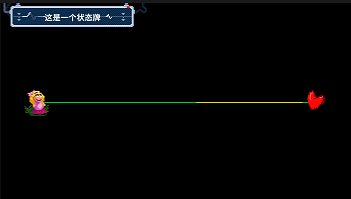

# 08 让角色在歌里聊起来

## 显示对话 

在不少剧情关卡里面角色都会有聊天的过程，这在编辑器内也是可以实现的，需要的是紫色版块中的“显示对话”功能。

点开后能很清晰地看到文本框，我们就是在这里输入对话。点击右下角的微笑脸可以选择出现的人物立绘：先选择人物，再选择动作。

当然了，这个立绘也是可以在文本框里面手动写入的，尤其是当你自定义了人物角色的时候。比如添加了一个吾夜犹明的猫猫，角色的文件名取为“WYYM”，那么在每一段的开头加上“WYYM:”即可，**注意必须为英文的冒号。**对于多组表情的管理，将在第20节里面介绍。

下面的三个设置内容都非常直观，就不再多赘述了。


**需要注意的是：**

**1、**显示对话的功能一次只能显示一个对话框，如果前一个的字幕没有走完下一个就开始了，那么前一个会直接被顶替掉。即使设置为屏幕上方和屏幕下方各一个也会被顶替。

**2、**一个对话框只能显示两行文字，多出来的会无法显示，请注意分段。分段后需要再输入一次立绘人物，否则立绘就不再显示了。

**3、**编辑器会自动识别标点符号，并在标点符号的位置自动添加不同程度的语句停顿，非常智能。

**4、**对话出现的速度是可以靠一些关键词来控制的，把它们打在对话框里面就行了：

* `[vslow]` - 非常慢
* `[slow]`  - 慢
* `[normal]` - 正常速度
* `[fast]` - 快
* `[vfast]` - 非常快
* `[shout]` - 闪烁屏幕，高速显示
* `[flash]` - 闪烁屏幕
* `[#]` - 暂停\#秒
* `[shake]` - 让位于该标签后的文本摇晃。 
* `[shakeRadius=X]` - 若与 \[shake\] 标签相邻，则设定摇晃的距离。
* `[wave]` - 让文本波浪式摇摆。 
* `[waveHeight=Y]`
* `[waveSpeed=X]` 
* `[swirl]` - 让文本以圆周运动的方式旋转。 
* `[swirlRadius=Y]` - 文本转起来
* `[swirlSpeed=X]` 
* `[static]` - 让此前设置移动方式的标签失效，位于该标签后的文本将不受前面的标签影响。

**5、**对话也是可以改变一小部分文字的颜色的，只需插入以下代码：`<color=#RRGGBBAA></color>` ，在两个尖括号的中间是需要改变颜色的文字。代码中的颜色可以使用六位16进制数来表示RGB颜色，也可以使用[Unity富文本的颜色名](https://docs.unity3d.com/Packages/com.unity.ugui@1.0/manual/StyledText.html)：

| 颜色（中文） | 颜色（英文） | RGB |
| :--- | :--- | :--- |
| 黑色 | black | \#000000 |
| 银色 | silver | \#c0c0c0 |
| 栗色 | maroon | \#800000 |
| 红色 | red | \#ff0000 |
| 深蓝色 | navy | \#000080 |
| 蓝色 | blue | \#0000ff |
| 浅蓝色 | lightblue | \#add8e6 |
| 紫色 | purple | \#800080 |
| 品红色 | fuchsia / magenta | \#ff00ff |
| 绿色 | green | \#008000 |
| 莱姆色 | lime | \#00ff00 |
| 橄榄色 | olive | \#808000 |
| 黄色 | yellow | \#ffff00 |
| 墨绿色 | teal | \#008080 |
| 青色 | cyan / aqua | \#00ffff |
| 灰色 | gray | \#808080 |
| 橙色 | orange | \#ffa500 |
| 白色 | white | \#ffffff |

## 显示状态牌 

除了这种对话框功能之外，游戏里还附带两个显示字幕的功能：

显示状态牌会在屏幕的左上角弹出一个带字幕的状态牌，效果如下：


状态牌的文字只可以显示一行。最好给状态牌文字设计得简洁一点。


## 弹幕效果 

另一种功能是弹幕效果：

这个功能会从右往左刷出一大堆相同的字符串，同样的，只支持输入一行文字。颜色也已调节，也可以选择随机的彩色。

## 演示关卡 

