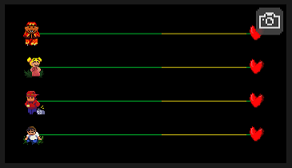
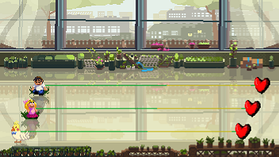
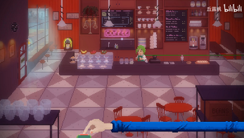

# 10 配合场景初始化轨道

当我们在一个房间里面设置了多根轨道的时候，角色位置会自动生成在屏幕上。不同的轨道数量下默认的位置也会不同：

* 一根轨道在屏幕的`(9.94%, 50.00%)`处
* 两根轨道在屏幕的`(9.94%, 60.61%)`,`(9.94%, 39.39%)`处
* 三根轨道在屏幕的`(9.94%, 71.21%)`,`(9.94%, 50.00%)`,`(9.94%, 28.79%)`处
* 四根轨道在屏幕的`(9.94%, 81.82%)`,`(9.94%, 60.61%)`,`(9.94%, 39.39%)`,`(9.94%, 18.18%)`处

此处的坐标原点为屏幕左下角，轨道的参考位置是人物像素画的中心点。如果任其按默认位置排布，会显得有些缺乏设计感。



所以在设计全程静止不动的轨道位置的时候，我们应该在一开始就让他们站在合适的位置上，并且最好能契合背景画面。下面我们那官方自带的一些场景来举例子。使用这些预设主题需要在紫色界面里面添加“设置主题”。


在时间轴最开始的位置设好三个人物的轨道移动，然后设置主题为“花房”。

```text
小男孩：
    位置: (49, 91)px；
    时长: 0 节拍。
小女孩：
    位置: (37, 62)px；
    时长: 0 节拍.
玄凤：
    位置: (25, 33)px；
    时长: 0 节拍。
```

这样三个角色都**站在地上**并且有一定的交错。没错，这就是`3-1`沉睡花园。




在室内外这类场景里，尽量让人物站在地上。飞在空中会显得有些奇怪。



我们预览播放一下会发现还是存在一些问题。角色是在**默认位置生成后再闪现**到设置好的位置的。

要优化这个问题，我们先要回到蓝色版块的人物设置里，把每个人物都选择“**隐藏**”，然后再时间轴的最开始加入三个“隐藏轨道”事件，让他们**“即刻”出现**。这样才能是一开始就在理想位置的。




实际上大家在做谱的时候也不必觉得轨道一定要完全展现在画面之内，像咖啡洗头神曲中咖啡师的爱心是全程看不见的。

甚至轨道可以大部分位置都不可见。比如二拍子只显示有心跳的地方，做成纯色等。


调用自定义方法`invisibleHeart = true`可以让轨道上的心脏消失。如果不选择角色，那么就只剩下一根线了，在一些极简色块画风的关卡里效果拔群。


