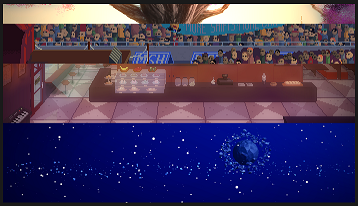

# 16 房间究竟该如何理解

从这一节开始，我们的节奏医生编辑器教程就提升到一个进阶的水平了，前面的15个章节讲解了编辑器的各种基础功能，足够用来完成一个中规中矩的谱面。为了让游戏的体验更加丰富，就需要学习更多更花哨的内容，这一节我们就从理解“房间”的概念开始。

编辑器总共支持四个房间，你可以想象成一栋宿舍有四个房，每个房里面可以住四个人，同时，每个房间的装修可以随意摆设互不干扰。房间的排布方式有两种，第一种是按照从上到下的顺序一行一行显示，我们在黄色的版块里添加一个“排列显示房间”就可以这样设置。

## **排列显示房间** 

将左边的可见房间点亮为黄色，屏幕上就会显示这个房间，高度可以自定义，如果不填的话就是默认平均分配。如果填写的数据总和超过了`100%`，那么就会按比例缩小到总和为`100%`，不填写的部分视为`0%`。例如，如果像上图四个房间填写`100%`，`200%`，`300%`，`400%`，那么实际效果和`10%`，`20%`，`30%`，`40%`是完全一样的。

下面还留有一个时长和缓速的选项，这个和轨道移动的时所介绍的设置规律是完全相同的。如果填写0拍就是瞬间完成房间分配。


如果你想直观地看看各种移动方式的速度区别，可以[看看这里](https://easings.net/cn)。


## **房间的前后关系** 

但实际上很多时候我们并不想就让房间这样死板地上下排布，甚至想让这些房间交叠在一起。打个比方，我在1号房间设置了男孩病房的主题，但是在2号房间设置的小男孩轨道，同时，我想让轨道显示在1号的主题中。要做到这一点，我们得先明确各个房间叠在一起的时候，它们的前后关系是怎样的。

首先看一个房间内，各种事件的由前往后关系是：

> 【浮动文字】&gt;【弹幕效果】&gt;【前景图片】&gt;【轨道4】&gt;【轨道3】&gt;【轨道2】&gt;【轨道1】&gt;【背景图片】

它们的前后顺序是不可改变的。

各个房间整体之间又有前后顺序，默认由前往后关系是：

> 【显示状态牌】&gt;【应用到：顶部】&gt;【房间1】&gt;【房间2】&gt;【房间3】&gt;【房间4】

这个顺序是可以改变的，只需要在黄色版块内添加一个“重新排序房间”物块，然后把前后顺序拖动到想要的即可。

在顺序中提到了应用到顶部，部分特效在选择房间的时候会多出这样一个顶部选项。

## 背景图片 

在房间的前后关系里我们提到了背景图片和前景图片这两个概念，也就是说，除了使用编辑器内自带的一些主题之外，其实自己也是可以自定义画面的背景和前景图案的。这个功能同样十分灵活，但是如果想要完全靠自己来原创或是临摹背景图片的话，可能需要对画像素画有一些掌握。

选择紫色的版块，放置一个“设置背景”的事件，发现里面有两种形式，一种是纯色，这个比较好理解，也就不介绍了，另一种是插入图片。


插入的图片必须是.png格式，如果你是自己画背景图，建议使用画布大小为352\*198像素。


下面有一个颜色选项，看似意义不明，但其实也有一定的用处。如果你导入的图片只有纯白和透明两种颜色，这个功能就可以为纯白的部分染色，染成你自己设置的颜色。但是因为一次只能设置一种颜色，使用起来也有些限制。

下面的缩放功能其实类似于操作系统里壁纸的填充方式，有如下的五种：

**填满：**将画面拉伸到横纵全部填满屏幕。要注意的是，如果你塞进去一张高清图，编辑器也会把它缩小到352\*198像素来适应画面，而且这个缩放机制是像素化的，画面会变得非常模糊。

**拉伸：**将画面等比拉伸直到上下水平线对齐屏幕。

**等比拉伸：**将画面等比拉伸直到左右垂直线对齐屏幕。

**居中：**就是按原画面大小放在正中间。

**平铺：**像铺瓷砖一样铺满屏幕。唯独这个选项会多冒出来一个速度设置，它可以让背景图片始终保持设置的速度移动，如果你还记得`4-2`这关的天空在慢慢移动的话，没错，使用的就是这个功能。这也是为什么我推荐你们将画布大小尽可能匹配编辑器的画面像素大小（即352\*198像素），不然平铺起来会非常诡异。另外，如果你想设计这样的移动背景，在作画的时候也需要考虑画面左右两端和上下两端的连续，否则画面运动起来会感觉到割裂。


如果你想做一个动图效果，需要把.gif拆解成一连串的.png图片，在选择图片时同时选择所有的图点击确定。接下来就会多出一个设置帧数的选项，来确定动图的播放速度。帧数 = \(背景图总画面数 / 一个循环占节拍数量\) \* 曲速/60。


## 前景图片 

相比之下前景图片的功能就少多了，不可以添加多个图片，也没法移动图片。设计这个功能的主要目的还是为了能产生一个图片覆盖轨道的机制，这样在画面效果的处理上可以更加灵活。

参考`2-3`咖啡洗头歌里面，咖啡师是站在桌子后面的，而不是浮在桌子上，其实就是桌子作为前景图片盖在了咖啡师轨道上（但是很可惜的是编辑器里面的默认主题里桌子在背景中，无法做出这样的效果）。

介绍完这些铺垫知识，本节内容量也相当大了，下一节我们就开始介绍房间排布里自由度最高的部分：移动房间和移动摄像头。

