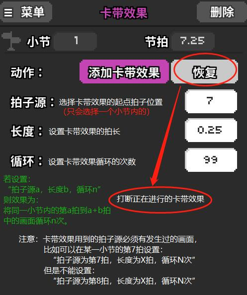

# 23 干扰图可以如何设计


在关卡中出现对比度较高画面快速交替，如红蓝、黑白快速闪烁，必须开启癫痫警告。使用“放克”特效，必须开启癫痫警告。使用“干扰”特效较多，建议开启癫痫警告。一秒出现3次以上快速闪烁，建议开启癫痫警告。



视觉干扰不等于读谱不能，更不等于塞爆。在官谱中，只有`1-X`，`2-1`，`2-X`，以及`4-2`的小部分用到了视觉干扰，而这些干扰是以为重复或单一的节奏增添趣味与挑战性而添加的，虽然一定意义上增加了读谱难度，但是仍让玩家有足够的时间反应，以及正常读谱。


## 卡带效果 

卡带效果可以让心跳在某一拍卡住（参考`1-X`东方不眠夜就清楚了）。

## **一些干扰效果举例** 

**竖直滚屏+VHS+电影噪点+高光**

带来信号干扰、丢失的感觉

**顶部镜厅+摄像头/房间动画**

旋转，跳跃，残影，你画面拉出了完美的拖尾

**屏幕翻转+颜色反转+滚屏**

画面你别乱跑

**短暂的噪点/干扰**

默数拍子开启

**放克+落雨+灰度+慢游戏速度**

听话，别把灰度去掉

**25%白色前景闪烁+暴风雪+雪花+VHS+关闭竖直滚屏+电影噪点+JPEG失真+落雨+快游戏速度**

最后的绝望（《冰与火之舞》 “XH-X  最后的希望”类似效果）

## 演示关卡

干扰图实际上更多是一种“凭直觉”的做特效过程，很多时候慢慢摸索就能搞出不少怪东西，本节由喜欢精灵宝可梦的黄黄提供演示关卡。



