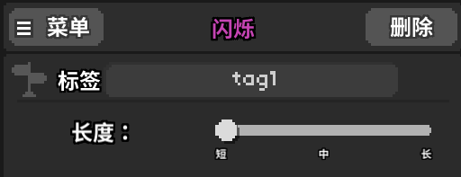

# 附录6 r19使用教程

[原文地址](https://hackmd.io/@WillFlame/rybdnRtwu) 原作者：WillFlame

### 条件

为事件设置条件可以使事件仅在满足特定条件时才会被执行。四个板块中的几乎所有事件都能被设置条件。

有两种打开条件菜单的方法：

**1. 在选中一个事件时点击位于左上角的指路牌按钮**


**2. 点击动作板块中的“条件”按钮** 


条件菜单是这样子的： 


这个菜单中包含了关卡中用到的所有条件，以便于对条件的修改与复用。

#### 创建一个条件


条件的**名称**无任何实际作用，只用于显示。 _译注：条件名称不支持使用中文_

条件的**类型**分为五种：

* **上一击** 基于上一次击中节拍的结果进行判断。
  * 可以进一步限定轨道和击中结果。
* **自定义** 基于表达式的结果进行判断。
  * 这是一个较为复杂的条件类型，更多细节将在后文中说明。
* **执行次数** 基于事件被执行的次数进行判断。
  * 注意：为了使一个事件被执行多次，你的关卡中必须存在循环或标签调用。
* **语言** 基于当前的游戏语言进行判断。
  * 可以用于使关卡中的浮动文字和对话内容根据游戏语言的不同而显示不同语言。
* **玩家模式** 基于当前的玩家数量（单人/双人）进行判断。

你还可以使用位于下方的删除按钮来删除这个条件。需要注意的是，删除条件的同时也会使关卡中的所有事件不再附有这个条件。

创建条件之后，把鼠标移到条件之上可以选择对条件进行修改和复制。 


点击复制按钮（位于左侧）会创建一个条件的副本，点击扳手按钮（位于右侧）可以对条件进行修改。创建一个条件的副本并不会自动让所有使用原条件的事件同时使用副本条件。

#### 为一个事件添加条件

通过为事件附加条件，你可以让事件由条件决定是否被执行。

一个**蓝色**的条件意味着事件仅当这个条件被满足时才会被执行，一个**红色**的条件意味着事件仅当这个条件不被满足时才会被执行。 _译注：当同时附有多个条件时，只有所有条件同时被满足，事件才会被执行。_

举个例子，附有如下条件的事件仅会在上一击完美且游戏语言不为英语时才会被执行。 


将鼠标移到一个事件的指路标之上，会显示这个事件所附有的所有条件。 


#### 条件持续时间

位于右上角的钟表图标可以让你为条件设置**持续时间**，即是这个事件可以（通过满足条件而）被执行的时间段长度。若在持续时间结束前未出现满足所有条件的情况，则该事件不会被执行。仅当在时间轴上经过该事件之后，才会开始对该事件所附条件进行判断。

需要注意的是，事件所附条件会在持续时间内的**每一帧**都被判断一次，这也意味着一个事件可能在他的条件持续时间内被执行多次。举例来说，一个带有8拍持续时间的事件会在他所在时间点接下来的8拍内不断检测是否所有条件都被满足，这可能会使这个事件被触发多次。

一个持续时间为0拍的事件只会在被经过时被触发一次。 _译注：所有事件的默认持续时间都是0拍。_

### 设置播放方式

通过设置播放方式，你可以改变播放头（时间轴上代表当前时间点的白线）的运动方式。

注意，更改播放方式**并不会**改变音乐的播放方式。音乐会正常播放，而不会受到更改播放方式的影响。

有六种播放方式：正常、循环、延长、立即、超级立即、延长一小节。

**不要在第一小节循环或是跳转到第一小节，这可能会导致一些问题。**

#### 正常

默认的播放方式，使播放头在时间轴上从左到右正常移动。 _译注：当对下一小节进行设置后，会在播放完小节之后跳转到所设置的下一小节，参照下文的**立即**播放方式部分_

#### 循环

会使播放头在到达当前小节末尾时跳转至当前小节的开头，这会被重复执行直至更改为其他播放方式。

#### 延长

这会使播放头到达当前小节末尾后停止移动，直至更改为其他播放方式。为了确保音乐与游戏内容的同步，当更改为其他播放方式后，播放头仍会停止移动，直至**游戏的音乐到达音乐的小节末尾**时才会恢复移动。


_播放头会保持在这里，直至播放方式被改变。_

需要注意，由于播放头不再移动，请确保设有某个带有条件的事件使播放方式会在播放头停止移动后被改变，否则你将会使关卡在这里被**卡住**。

使用`activeDialogues`mod会自动将播放方式设为延长，同时让播放框保留在屏幕上，直至接收到用户输入。

_译注：经测试，现版本的设置播放方式事件存在bug，无法使播放方式被设为延长。需要使用自定义方法`SetPlayStyle(str:Prolong)`进行替代_

#### 立即

这会使播放头在**大约667ms**后跳转到指定小节的开头。指定的小节可以是绝对的，也可以是相对于当前小节的。 


与自定义方法`SetNextBar()`不同的是，这个事件可以在一个小节的中途（甚至是两拍之间）被执行。

由于跳转会在播放方式改为立即的一段固定时长后发生，这几乎必然会导致游戏内容与音乐失去同步。

#### 超级立即

这会使播放头在**大约300ms**后跳转到指定小节的开头。

这几乎必然会导致游戏内容与音乐失去同步。

#### 延长下一小节

_译注：原文中并无对此播放方式的讲解。经测试，现版本中疑似存在类似**延长**播放方式的bug。_

### 标签

标签可以用于将事件分组，同时执行一组事件，且允许一组事件被任意执行若干次。


多个事件可以带有相同的标签，当标签被执行时，会视为将播放头移到带有这个标签的事件组之中最靠前的事件的位置，并从此处开始，如同正常播放一样，依次执行带有这个标签的事件。**注意：所有带有相同标签的事件之间的最远距离不能超过一小节**，更长的距离可能会导致不可预测的结果。

> 应对一小节长度限制的一种常见对策是在关卡的结尾将小节长度设为99。

带有标签的事件可以通过标签调用而被执行任意次。这使得事件能被更好地管理和复用。标签同样也可以被禁用，被禁用的标签不再会被执行。

> **注意：目前版本中，带有标签的播放音效事件并没有被良好支持，当调用标签时，播放音效事件会在比预期执行时间更晚的时间（大约300ms后）被执行。**

这里有两种变通方案（不推荐）：

* 将播放音效事件在时间轴上的位置稍微提前。
  * 若没有更多带有相同标签的事件，你可能会需要创建一个空白事件以作为锚点。
* 使用自定义方法调用标签，并将 Execution Time 设为 OnPreBar。
  * 这可能导致其余带有相同标签的事件的执行时间发生变化。

#### 标记事件

按下`Shift-0`以切换事件标签框的显示状态。每个事件只能带有一个标签。当一个事件带有标签时，事件图标的左下角会带有一个橙色标记。



与一般的事件不同的是，带有标签的事件不会在播放头经过它们时被执行。这意味着带有标签的事件可以被放置在关卡的任何位置。带有标签的事件必须通过一个额外的事件来执行。

> 注意：带有标签的 VFX 事件目前存在 bug，会在播放头经过它们时被执行。当关卡从头开始播放时并不存在这个问题。

#### 调用标签

> 注意：任何时候都不要让一个事件调用自己所带的标签（即递归调用），这会令在编辑器中将播放头移至第一小节之外的任何位置这一行为导致游戏崩溃。

标签可以以两种方式被调用：

**1. 标签动作事件**


标签动作事件位于动作板块事件列表的最底部。在动作下拉菜单中选择`运行标签`或`运行包含以下文字的标签`，并填入标签名称。标签会在播放头经过标签动作事件时被调用，除非标签动作事件本身也带有标签（见下文的标签层叠部分）。

**2. RunTag\(\)自定义方法（或是RunEventsWithTags\(\)）**


这要求使用自定义方法事件（动作板块事件列表的最底部）。`RunTag()`与`RunEventsWithTags()`的作用完全相同，且都需要在标签名称前添加`str:`。

#### 标签的启用与禁用

标签动作事件允许启用或禁用指定名称的标签，或是名称带有指定文字的所有标签。

对应的自定义方法如下所示：（将`tagName`替换为你的标签名称）

```text
EnableTag(str:tagName)   //目前不可用
DisableTag(str:tagName)
EnableTagsContaining(str:tagName)
DisableTagsContaining(str:tagName)
```

尽管标签的启用和禁用可以被条件完全替代，但与之相比使用标签的启用与禁用可能会更为便利。

#### 特殊标签

标签开头可以附加有特殊标签，如下所示。这些标签会在满足特定条件时被自动调用，而不需要使用标签动作手动调用。


| 标签 | 条件 |
| :--- | :--- |
| `[onHit]` | 每当有节拍被击中 |
| `[onMiss]` | 每当有节拍被错过 |
| `[onHeldPressHit]` | 每当有长按拍按下判定被击中 |
| `[onHeldReleaseHit]` | 每当有长按拍松开判定被击中 |
| `[onHeldPressMiss]` | 每当有长按拍按下判定被错过 |
| `[onHeldReleaseMiss]` | 每当有长按拍松开判定被错过 |
| `[rowX]`（X是数字） | 使特殊标签只作用于特定轨道 |

对于`[rowX]`标签，X是从0开始计数的。例如，标签`[onHit][row0]`会在每次第一条轨道上有拍子被击中时被调用。如果输入的轨道编号不存在，则会应用于所有轨道（即这个特殊标签会被忽略）。

这些特殊标签也可以作为启用/禁用标签事件的作用对象。由于这些特殊标签会被频繁调用，通过启用/禁用标签来进行管理会比使用条件来进行管理方便得多。

#### 标签层叠

对于更复杂的分组情况，你可能要考虑用一个标签调用另一个标签（这被称作标签层叠）。由于标签动作事件和调用自定义方法事件都可以被打上标签，你可以用这种方式使用一个标签去调用若干个其他标签。 


### 变量

游戏中有两种类型的变量：**只读变量**和**可写变量**，只读变量的值无法被修改，而可变变量的值可以被修改。

#### 可写变量

游戏中有三种类型的可写变量：**整型**\(i\)、**浮点型**\(f\)、**布尔型**\(b\)，每种类型的变量有10个，变量的名称无法更改，只可以更改变量的值。

* 整型变量的名称为`i0`、`i1`、...、`i9`。
  * 可以储存`-2,147,483,648`至`2,147,483,647`之间的任何整数。
* 浮点型变量的名称为`f0`、`f1`、...、`f9`。
* 布尔型变量的名称为`b0`、`b1`、...、`b9`。
  * 只能储存`True`或`False`

变量`buttonPressCount`与整型变量一样（可以被修改），但它的值会在玩家按键时增加。

#### 只读变量

这些特殊的变量提供了有关游戏当前关卡或当前状态的信息，它们的值无法被更改，只能用于读取。

| 变量名 | 定义 |
| :--- | :--- |
| `bpm` | 当前的bpm |
| `barNumber` | 当前所在的小节编号 |
| `numEarlyHits` | 目前过早按拍的次数 |
| `numLateHits` | 目前过晚按拍的次数 |
| `numPerfectHits` | 目前完美按拍的次数 |
| `numMisses` | 目前错过拍子的次数（不考虑错误权重） |
| `numMistakes` | 目前错过拍子的次数（考虑错误权重） |
| `XPress`（X是按键名） | 当X被按下的瞬间值为`true`，其余时刻为`false` |
| `XRelease` | 当X被松开的瞬间值为`true`，其余时刻为`false` |
| `XIsPressed` | 当X被按下时值为`true`，否则为`false` |

允许使用的按键名有：`p1`、`p2`、`anyPlayer`、`up`、`down`、`left`、`right`。

#### 使用变量

变量可以在三种场合使用：

* 调用自定义方法
* 浮动文字、显示对话、显示状态牌
* 条件

**调用自定义方法**

可以在调用自定义方法的表达式框里对变量进行读写。通过与条件的结合，可以实现简单的编程。

支持的运算符有`++`、`--`、`=`。

举例：`i1++`、`i2 = 4`。

**浮动文字、显示对话、显示状态牌**

变量可以嵌入到这些事件的显示内容中，只需把表达式用大括号包裹起来即可。

举例：`我有{i1}个苹果`、`我们有{i1 + i2}个梨子`。

**条件**

变量可以用于自定义类型条件的表达式框之中。通常与这些运算符结合使用：`==`、`!=`、`>`、`<`。

举例：`i1 == 1`、`i2 > i3`。

#### 运算符

除去比较运算符以外，还可以使用数学运算符 `+`、`-`、`*`、`/`、`%`（取模）。

