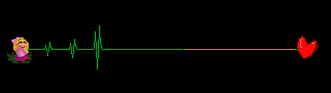
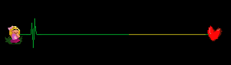

# 14 为何总被说读谱不能


这一节可能会显得有些絮絮叨叨的，我想试图告诉你到底哪些情况是会让玩家在玩自制谱的时候会感到不明所以的。

想要理解这一节所讲的内容，也许你得现在脑海中有一个这样的感知：有的关卡虽然难度很高，拍子很复杂，但是你一玩就知道理应在哪里按下，即使你先前都没有听过这首曲子；而有的关卡虽然难度不高，但是你就是弄不懂作者想要做什么样的节奏，完全摸不着头脑。

这种区别来自于很多方面。有节奏设计本身带来的，游戏引导提示带来的，也有特效设置合理程度带来的等等。我们会在下面注意讨论。

## **特效与节奏的平衡** 

我们回忆一下官方的所有关卡就能发现，游戏节奏的复杂程度和游戏画面的花哨程度往往都是成反比的。东方不眠夜和咖啡之歌的演出效果非常惊艳，他们的节奏也就并不复杂，从头到尾都是一根轨道。像典雅或者是隐形，节奏设计非常复杂，那么所有轨道都是一行行排开固定不动（或许有一些小范围的移动，但不影响），方便你能看清心电图。在早版本的`4-2`《隐形》里面。轨道还是会颠过来倒过去的，但因为读谱难度过大官方取消了这个设计。

从官谱里面总结经验往往是最方便的。总的来说，如果画面的视觉干扰太大的话，玩家的注意力是有限的，就只能面对一个比较稳定的节奏。在里面添加变化的时候，可能会完全观察不到或者反应不过来。

## **游戏引导提示** 

这个在上一节里面详细讲述了。上一节主要是介绍方法，这里来讲一讲为什么。节奏医生说到底是一款偏向于打节奏的游戏，而且面向群体很广，作为做谱者不能像其他音乐游戏那样要求玩家的进化速度惊人。我们要做的并非是魔王曲，而是一个能让大多数玩家顺利完成的曲子。对于玩家而言面对一首全新的曲子（很多时候都是全新的，对于全原创的官方谱更是），是并不能预先猜测到会出现怎样的节奏的。节奏医生官方谱里面的节奏到目前为止每一个单独的轨道都不复杂，到现在为止官方还没有让玩家真正操作自由节拍。但即使是这样，游戏的教程环节也占据了很大一部分时长，为的就是让玩家能对接下来会遇到什么有一个心理预期。

所以我们在制作自制谱的时候也应该秉承这个理念，虽然没办法加入教程环节，但也可以用各种各样的办法实现类似的效果。

## 采音

把一段音乐里面所有出现节奏点的地方都至少放上一个心跳或者按拍，这是很多萌新都会想去做的事情。但我们要清楚，很多时候旋律本身其实是很随性的，如果全部采到音，那么整个谱面会变成一大堆的自由拍子。

普通七拍子把`X`算到一起，一定是七个等距的采音，所以有一些微弱的不搭，是可以忽略的。比如说音乐是弹录的钢琴曲，那么钢琴师没法像软件那样精确时间弹奏每一个音，总可能会多多少少有些误差，或者是自己兴致起来有些自己发挥的节奏（实际上`4-3`这关就是弹录的）。这些就可以不用把精度调到非常高去慢慢抠了。

七拍子的时间段里面还有一些其它的音在八分之一或者甚至十六分之一拍上，导致总采音量应当是超过七个的时候，多的那些中间旮旯的就可以无视掉了，保持七拍子稳定即可。

有些配器的旋律虽然在音乐里听感非常突出，但是完全不需要为其设置轨道，例如`3-2`[典雅](https://www.bilibili.com/video/BV1PZ4y1P7yE?p=24)的1分41秒开始高音部分虽然很动感但是没有对应轨道；`4-2`[隐形](https://www.bilibili.com/video/BV1PZ4y1P7yE?p=36)的1分02秒开始高音部分也没有对应轨道，`4-2N`的玄凤是对应此声部的，但并没有把所有音都压上，空出了一些，保持了`-x-x-x----♥`的节奏。

而反过来，如果你觉得音乐的节奏感不足，那么配以合适的音效声是可以把轨道直接融入在音乐里的。相当于设计节奏的同时为音乐本身添加了新的配器。例如`3-2`[典雅](https://www.bilibili.com/video/BV1PZ4y1P7yE?p=24)的政客轨道，其实音乐本身是没有这部分音轨的。

## **节奏设计** 

多轨道的设计原则在前面以及说到了。这里主要是提及一些单轨需要避免的操作，当然了，如果你有足够的自信确定把提示设计好了，那么下述所说的都可以无视。

首先一个很重要的点，对于一个非常快速的节奏，一定要给玩家一个提前量，让他能感受到前方高能。这一点在`2-2`是做的非常好的，游戏从非常慢开始，逐渐加快，让你知道这一关要挑战速度变化，然后休整一段时间慢下去，最后高潮部分速度最快，玩家就会有一种预期，能感觉到后面肯定有非常快的节奏。如果不给这样一个渐进那么游玩体验一定是非常痛苦的，节拍很难找准。

做自制谱的时候也是一样，如果要设计一个突然速度飞快的节奏，一定要给玩家充足的心理准备。 

同时在一根轨道里也不要把几个节奏都堆在一起，一般来说同一轨道内出现一次性出现多个节奏时会把节奏声加重，很影响听歌体验。更不要前一个慢节奏正走着呢，后面一个快节奏超过去。并不是说这样就绝对不能读出谱了，只是说这样的设计思路并不符合思考的直觉。

当你想要在七拍子中加入`X`记号的时候，**注意不要一次性加入超过四个**`X`。

如果轨道中有四个，那么带给玩家的压力会很大，想必你也能回想起猫头鹰节奏带来的恐惧，第一次玩的时候其实很难反应过来。如果有强烈的意愿需要加入四个`X`，还是需要加入显眼的节奏提示，对于高BPM歌曲还需要给出更多的节奏提前量让玩家不至于反应不过来，或者干脆让电脑先演示一遍。

如果轨道中有五个，那么实际上它和二拍子的节奏是完全相同的，没有强烈的必要的情况下还是建议直接改成二拍子；即使非要保留这种节奏也需要和二拍子一样加入护士提示。

如果轨道中有六个，那就相当于没有前置节奏，凭空冒出来一个按拍。有的同学可能会说，不会呀，心跳经过`X`记号的时候`X`记号也会弹一下，可以通过数这个微弱的弹跳来感受节奏。对于目押来说，这确实是可行的，但是一个优质谱我们还需要考虑视力障碍玩家游玩的可行性。对于纯音押来说，节奏上的`X`记号是完全无声的，也就是不可读谱的。

